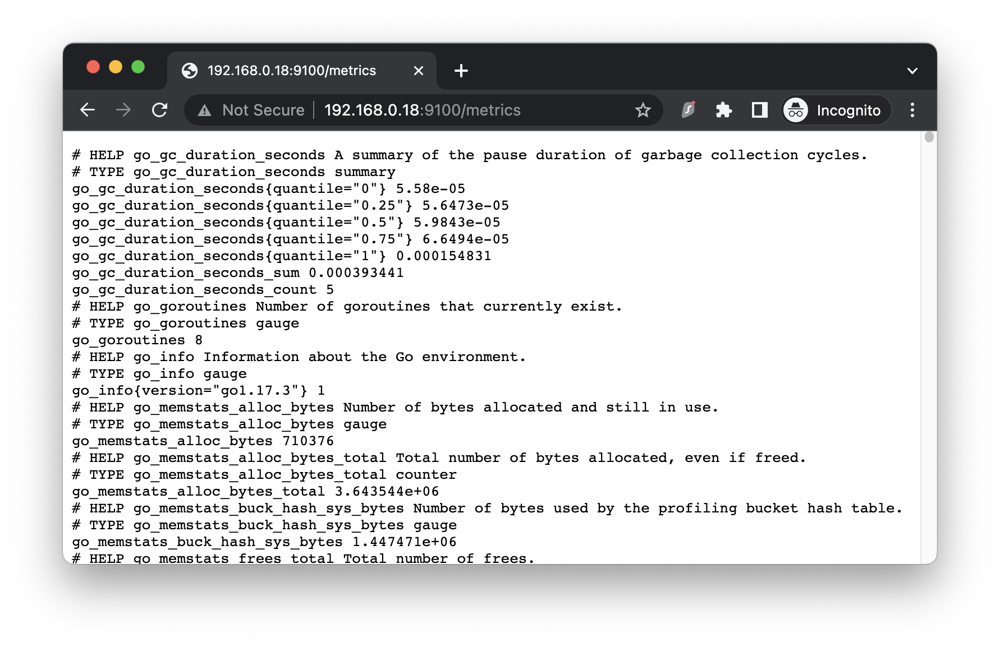
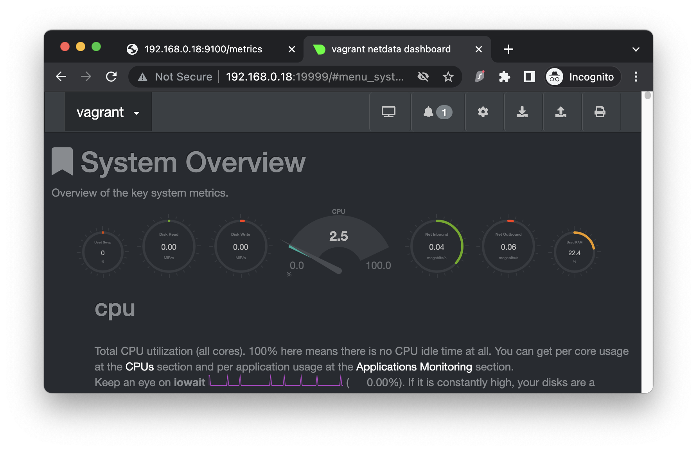

# Домашнее задание к занятию "3.4. Операционные системы, лекция 2"

> 1. На лекции мы познакомились с node_exporter. В демонстрации его исполняемый файл запускался в background. Этого достаточно для демо, но не для настоящей production-системы, где процессы должны находиться под внешним управлением. Используя знания из лекции по systemd, создайте самостоятельно простой unit-файл для node_exporter:
> * поместите его в автозагрузку,
> * предусмотрите возможность добавления опций к запускаемому процессу через внешний файл (посмотрите, например, на systemctl cat cron),
> * удостоверьтесь, что с помощью systemctl процесс корректно стартует, завершается, а после перезагрузки автоматически поднимается.

Создан отдельный пользователь для запуска процесса, добавлен файл запуска сервиса и включен автоматический запуск при загрузке системы. 

    vagrant@vagrant:~$ sudo cat /etc/systemd/system/node_exporter.service
    [Unit]
    Description=Node Exporter
    [Service]
    User=node_exporter
    Group=node_exporter
    Type=simple
    ExecStart=/usr/local/bin/node_exporter
    EnvironmentFile=/etc/default/node_exporter
    [Install]
    WantedBy=multi-user.target

    vagrant@vagrant:~$ sudo systemctl enable node_exporter
    Created symlink /etc/systemd/system/multi-user.target.wants/node_exporter.service → /etc/systemd/system/node_exporter.service.

    vagrant@vagrant:~$ sudo systemctl status node_exporter
    ● node_exporter.service - Node Exporter
    Loaded: loaded (/etc/systemd/system/node_exporter.service; disabled; vendor preset: enabled)
    Active: active (running) since Wed 2022-07-06 04:22:03 UTC; 30min ago
    Main PID: 1994 (node_exporter)
    Tasks: 7 (limit: 1066)
    Memory: 5.0M
    CGroup: /system.slice/node_exporter.service
    └─1994 /usr/local/bin/node_exporter

> Задание 1
>
> Предлагаю уточнить как именно в службу будут передаваться дополнительные опции. Примеры можно посмотреть вот здесь:
>
> https://www.freedesktop.org/software/systemd/man/systemd.service.html#ExecStart=
>
> https://unix.stackexchange.com/questions/323914/dynamic-variables-in-systemd-service-unit-files
>
> https://stackoverflow.com/questions/48843949/systemd-use-variables-in-a-unit-file
>
> Замечу, что речь идёт не о переменных окружения, а об опциях (параметрах) запуска службы.

Дополнительные опции указываются в строке команды запуска execstart. Они выполняются при старте службы.

> 2. Ознакомьтесь с опциями node_exporter и выводом /metrics по-умолчанию. Приведите несколько опций, которые вы бы выбрали для базового мониторинга хоста по CPU, памяти, диску и сети.

Я бы использовал следующие параметры для мониторинга активности:
CPU:

    node_cpu_seconds_total{mode="idle"}
    node_cpu_seconds_total{mode="iowait"}
    node_cpu_seconds_total{mode="system"}
    node_cpu_seconds_total{mode="user"}
Memory:

    node_memory_MemAvailable_bytes
    node_memory_MemFree_bytes
    node_memory_MemTotal_bytes
Disk:

    node_disk_io_now
    node_disk_read_time_seconds_total
    node_disk_reads_completed_total

    node_disk_write_time_seconds_total
    node_disk_writes_completed_total

    node_filesystem_avail_bytes
    node_filesystem_files
    node_filesystem_free_bytes
    node_filesystem_size_bytes
Network:

    node_network_receive_bytes_total
    node_network_receive_drop_total
    node_network_receive_errs_total
    node_network_receive_multicast_total

    node_network_transmit_bytes_total
    node_network_transmit_drop_total
    node_network_transmit_errs_total
    node_network_transmit_queue_length

> 3. Установите в свою виртуальную машину Netdata. Воспользуйтесь готовыми пакетами для установки (sudo apt install -y netdata). После успешной установки:
> * в конфигурационном файле /etc/netdata/netdata.conf в секции [web] замените значение с localhost на bind to = 0.0.0.0,
> * добавьте в Vagrantfile проброс порта Netdata на свой локальный компьютер и сделайте vagrant reload:

    config.vm.network "forwarded_port", guest: 19999, host: 19999
> После успешной перезагрузки в браузере на своем ПК (не в виртуальной машине) вы должны суметь зайти на localhost:19999. Ознакомьтесь с метриками, которые по умолчанию собираются Netdata и с комментариями, которые даны к этим метрикам.

Для удобства работы с виртуальной машиной был выполнен не проброс портов, а бридж с внешней сетевой картой потому как все действия выполняю с мака и не очень удобно полдключаться по rdp к компьютеру с Windows на котором работает VirtualBox и Vagrant.

> 4. Можно ли по выводу dmesg понять, осознает ли ОС, что загружена не на настоящем оборудовании, а на системе виртуализации?

Да, можно:

    vagrant@vagrant:~$ sudo dmesg | grep "Hypervisor detected"
    [    0.000000] Hypervisor detected: KVM

> 5. Как настроен sysctl fs.nr_open на системе по-умолчанию? Узнайте, что означает этот параметр. Какой другой существующий лимит не позволит достичь такого числа (ulimit --help)?

Максимальное число открытых файлов ограниченное системой:

    vagrant@vagrant:~$ sysctl fs.nr_open
    fs.nr_open = 1048576
Максимальное число открытых файлов ограниченное процессором:

    vagrant@vagrant:~$ cat /proc/sys/fs/file-max
    9223372036854775807

> 6. Запустите любой долгоживущий процесс (не ls, который отработает мгновенно, а, например, sleep 1h) в отдельном неймспейсе процессов; покажите, что ваш процесс работает под PID 1 через nsenter. Для простоты работайте в данном задании под root (sudo -i). Под обычным пользователем требуются дополнительные опции (--map-root-user) и т.д.

Запускаю процесс:

    vagrant@vagrant:~$ sudo unshare -f --pid --mount-proc sleep 1h
В новом терминале:

    vagrant@vagrant:~$ ps -e|grep sleep
    1430 pts/1    00:00:00 sleep
    
    vagrant@vagrant:~$ sudo nsenter --target 1430 --pid --mount
    
    root@vagrant:/# ps -e
    PID TTY          TIME CMD
    1 pts/1    00:00:00 sleep
    2 pts/2    00:00:00 bash
    14 pts/2    00:00:00 ps

> 7. Найдите информацию о том, что такое :(){ :|:& };:. Запустите эту команду в своей виртуальной машине Vagrant с Ubuntu 20.04 (это важно, поведение в других ОС не проверялось). Некоторое время все будет "плохо", после чего (минуты) – ОС должна стабилизироваться. Вызов dmesg расскажет, какой механизм помог автоматической стабилизации. Как настроен этот механизм по-умолчанию, и как изменить число процессов, которое можно создать в сессии?

Это форк-бомба - функция запускает два своих экземпляра продолжая рекурсивно.

Ограничивающий количество задач процесс:

    vagrant@vagrant:~$ systemctl status user.slice
    ● user.slice - User and Session Slice
    Loaded: loaded (/lib/systemd/system/user.slice; static; vendor preset: enabled)
    Active: active since Wed 2022-07-06 10:33:06 UTC; 56min ago
    Docs: man:systemd.special(7)
    Tasks: 14
    Memory: 23.4M
    CGroup: /user.slice
    └─user-1000.slice
      ├─session-1.scope
      │ ├─1276 sshd: vagrant [priv]
      │ ├─1313 sshd: vagrant@pts/0
      │ └─1314 -bash
      ├─session-3.scope
      │ ├─ 1337 sshd: vagrant [priv]
      │ ├─ 1377 sshd: vagrant@pts/1
      │ ├─ 1378 -bash
      │ ├─ 1430 sleep 1h
      │ ├─53267 systemctl status user.slice
      │ └─53268 pager
      ├─session-4.scope
      │ ├─1387 sshd: vagrant [priv]
      │ ├─1417 sshd: vagrant@pts/2
      │ └─1418 -bash
      └─user@1000.service
        └─init.scope
          ├─1279 /lib/systemd/systemd --user
          └─1280 (sd-pam)

Максимальное число процессов по умолчанию max user processes=3554:

    vagrant@vagrant:~$ ulimit -a
    core file size          (blocks, -c) 0
    data seg size           (kbytes, -d) unlimited
    scheduling priority             (-e) 0
    file size               (blocks, -f) unlimited
    pending signals                 (-i) 3554
    max locked memory       (kbytes, -l) 65536
    max memory size         (kbytes, -m) unlimited
    open files                      (-n) 1024
    pipe size            (512 bytes, -p) 8
    POSIX message queues     (bytes, -q) 819200
    real-time priority              (-r) 0
    stack size              (kbytes, -s) 8192
    cpu time               (seconds, -t) unlimited
    max user processes              (-u) 3554
    virtual memory          (kbytes, -v) unlimited
    file locks                      (-x) unlimited

Изменено максимальное количество процессов:

    vagrant@vagrant:~$ cat /etc/security/limits.conf | grep vagrant
    vagrant          hard    nproc           20

    vagrant@vagrant:~$ ulimit -a | grep proc
    max user processes              (-u) 20

