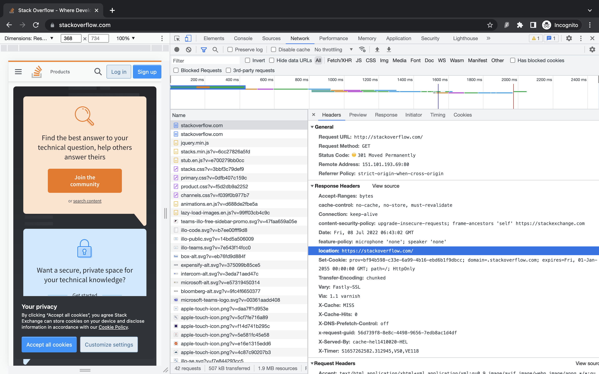
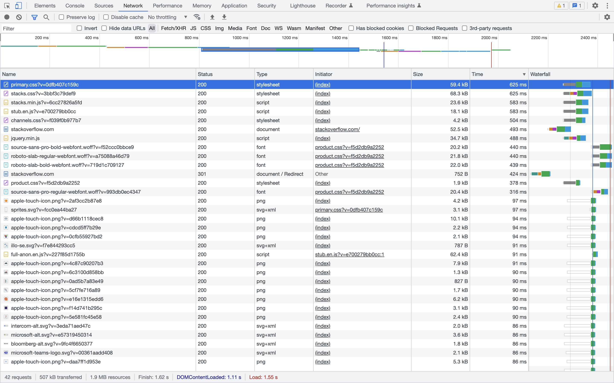
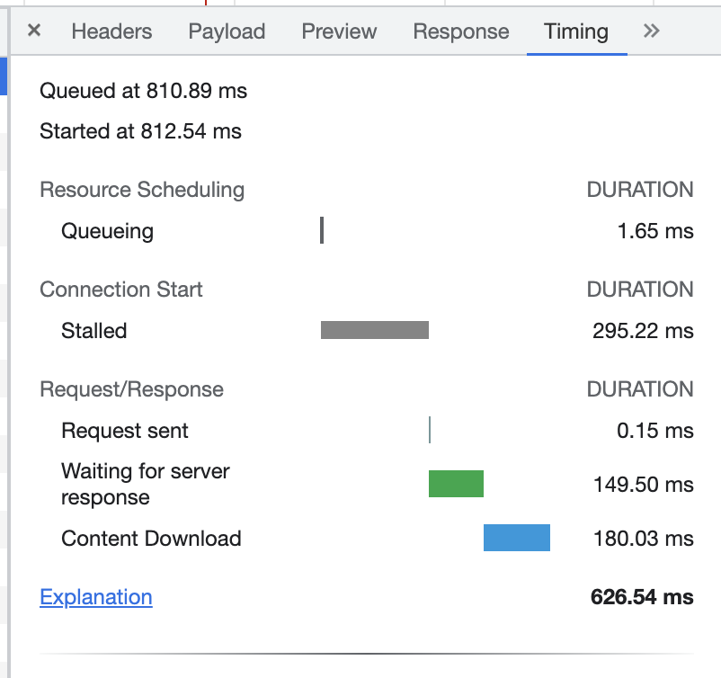

# Домашнее задание к занятию "3.6. Компьютерные сети, лекция 1"

> 1. Работа c HTTP через телнет. Подключитесь утилитой телнет к сайту stackoverflow.com telnet stackoverflow.com 80 отправьте HTTP запрос

    GET /questions HTTP/1.0
    HOST: stackoverflow.com
    [press enter]
    [press enter]

> В ответе укажите полученный HTTP код, что он означает?

Код означает, что запрашиваемый URL перемещен на https://stackoverflow.com/questions.

    vagrant@vagrant:~$ telnet stackoverflow.com 80
    Trying 151.101.129.69...
    Connected to stackoverflow.com.
    Escape character is '^]'.
    GET /questions HTTP/1.0
    HOST: stackoverflow.com
    
    HTTP/1.1 301 Moved Permanently
    cache-control: no-cache, no-store, must-revalidate
    location: https://stackoverflow.com/questions
    x-request-guid: 57560a1d-86d8-4a82-aa70-e835731c943b
    feature-policy: microphone 'none'; speaker 'none'
    content-security-policy: upgrade-insecure-requests; frame-ancestors 'self' https://stackexchange.com
    Accept-Ranges: bytes
    Date: Fri, 08 Jul 2022 06:05:14 GMT
    Via: 1.1 varnish
    Connection: close
    X-Served-By: cache-cdg20775-CDG
    X-Cache: MISS
    X-Cache-Hits: 0
    X-Timer: S1657260315.555243,VS0,VE80
    Vary: Fastly-SSL
    X-DNS-Prefetch-Control: off
    Set-Cookie: prov=976b7af6-8218-d34b-270f-5a3357693a44; domain=.stackoverflow.com; expires=Fri, 01-Jan-2055 00:00:00 GMT; path=/; HttpOnly
    
    Connection closed by foreign host.

> 2. Повторите задание 1 в браузере, используя консоль разработчика F12.
> * откройте вкладку Network 
> * отправьте запрос http://stackoverflow.com
> * найдите первый ответ HTTP сервера, откройте вкладку Headers 
> * укажите в ответе полученный HTTP код. 
> * проверьте время загрузки страницы, какой запрос обрабатывался дольше всего? 
> * приложите скриншот консоли браузера в ответ.

Первый ответ веб-сервера:

Список запросов к веб-серверу сортированные по длительности:

Самый долгий запрос стилей:

> 3. Какой IP адрес у вас в интернете?

    vagrant@vagrant:~$ dig -4 TXT +short o-o.myaddr.l.google.com @ns1.google.com
    "146.70.114.12"

> 4. Какому провайдеру принадлежит ваш IP адрес? Какой автономной системе AS? Воспользуйтесь утилитой whois

    vagrant@vagrant:~$ whois -h whois.radb.net 146.70.114.12
    route:          146.70.114.0/24
    origin:         AS9009
    mnt-by:         GLOBALAXS-MNT
    created:        2022-04-01T14:11:11Z
    last-modified:  2022-04-01T14:11:11Z
    source:         RIPE

> 5. Через какие сети проходит пакет, отправленный с вашего компьютера на адрес 8.8.8.8? Через какие AS? Воспользуйтесь утилитой traceroute

    vagrant@vagrant:~$ sudo traceroute -IAn 8.8.8.8
    traceroute to 8.8.8.8 (8.8.8.8), 30 hops max, 60 byte packets
    1  10.0.2.2 [*]  0.262 ms  0.241 ms  0.237 ms
    2  * * *
    3  * * *
    4  * * *
    5  * * *
    6  146.70.114.9 [AS9009]  113.680 ms  104.820 ms  104.807 ms
    7  82.102.29.30 [AS9009]  104.527 ms  104.789 ms  92.445 ms
    8  149.6.174.89 [AS174]  121.591 ms  121.914 ms  121.908 ms
    9  154.54.58.5 [AS174]  122.114 ms  121.669 ms  121.630 ms
    10  154.54.56.234 [AS174]  121.605 ms  121.763 ms  121.383 ms
    11  154.54.36.253 [AS174]  121.367 ms  121.356 ms  121.691 ms
    12  130.117.15.86 [AS174]  104.822 ms  104.795 ms  104.784 ms
    13  72.14.196.162 [AS15169]  103.862 ms  108.819 ms  108.905 ms
    14  108.170.251.193 [AS15169]  115.458 ms  116.196 ms  115.605 ms
    15  142.250.213.213 [AS15169]  114.831 ms  114.978 ms  118.350 ms
    16  8.8.8.8 [AS15169]  117.142 ms  118.246 ms  118.218 ms

> 6. Повторите задание 5 в утилите mtr. На каком участке наибольшая задержка - delay?

Наибольшая задержка на хосте 9. be2974.ccr21.muc03.atlas.cogentco.com

                                    My traceroute  [v0.93]
    vagrant (10.0.2.15)                                                  2022-07-08T05:34:27+0000
    Keys:  Help   Display mode   Restart statistics   Order of fields   quit
    Packets               Pings
    Host                                              Loss%   Snt   Last   Avg  Best  Wrst StDev
    1. _gateway                                        0.0%    51    1.1   1.1   0.4   1.9   0.4
    2. (waiting for reply)
    3. (waiting for reply)
    4. (waiting for reply)
    5. (waiting for reply)
    6. 146.70.114.9                                    0.0%    51  104.2 113.7  96.6 210.0  22.7
    7. vlan2910.bb2.vie1.at.m247.com                   2.0%    51  110.7 100.1  92.3 142.8  11.9
    8. te0-3-0-4-6.ccr51.vie01.atlas.cogentco.com      0.0%    51  125.0 123.7 121.6 127.6   1.4
    9. be2974.ccr21.muc03.atlas.cogentco.com           0.0%    51  124.1 123.9 121.6 134.8   2.1
    10. be2672.ccr22.muc03.atlas.cogentco.com          0.0%    50  125.1 123.6 121.1 129.8   1.9
    11. be2960.ccr42.fra03.atlas.cogentco.com          2.0%    50  121.6 123.8 121.6 133.9   2.3
    12. tata.fra03.atlas.cogentco.com                  0.0%    50  107.9 106.8 103.6 124.4   3.2
    13. 72.14.196.162                                  0.0%    50  106.7 107.8 103.6 141.3   6.8
    14. 108.170.251.193                                0.0%    50  116.6 117.3 115.5 120.2   1.2
    15. 142.250.213.213                                0.0%    50  116.8 117.0 114.9 120.3   1.4
    16. dns.google                                     0.0%    50  115.6 116.8 114.9 122.8   1.6

> 7. Какие DNS сервера отвечают за доменное имя dns.google? Какие A записи? воспользуйтесь утилитой dig

    vagrant@vagrant:~$ dig dns.google.com 
    ; <<>> DiG 9.16.1-Ubuntu <<>> dns.google.com
    ;; ANSWER SECTION:
    dns.google.com.         174     IN      A       8.8.8.8
    dns.google.com.         174     IN      A       8.8.4.4

> 8. Проверьте PTR записи для IP адресов из задания 7. Какое доменное имя привязано к IP? воспользуйтесь утилитой dig

Доменное имя: dns.google.com

    vagrant@vagrant:~$ dig -x 8.8.4.4
    ;; ANSWER SECTION:
    4.4.8.8.in-addr.arpa.   22603   IN      PTR     dns.google.

    vagrant@vagrant:~$ dig -x 8.8.8.8
    ;; ANSWER SECTION:
    8.8.8.8.in-addr.arpa.   354     IN      PTR     dns.google.