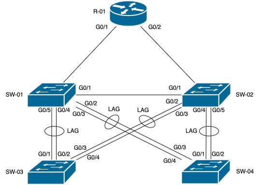

# Домашнее задание к занятию "3.8. Компьютерные сети, лекция 3"

> 1. Подключитесь к публичному маршрутизатору в интернет. Найдите маршрут к вашему публичному IP

    telnet route-views.routeviews.org
    Username: rviews
    show ip route x.x.x.x/32
    show bgp x.x.x.x/32

    vagrant@vagrant:~$ telnet route-views.routeviews.org
    Trying 128.223.51.103...
    Connected to route-views.routeviews.org.
    Escape character is '^]'.
    C
    **********************************************************************
    
                        RouteViews BGP Route Viewer
                        route-views.routeviews.org
    
    route views data is archived on http://archive.routeviews.org
    
    This hardware is part of a grant by the NSF.
    Please contact help@routeviews.org if you have questions, or
    if you wish to contribute your view.
    
    This router has views of full routing tables from several ASes.
    The list of peers is located at http://www.routeviews.org/peers
    in route-views.oregon-ix.net.txt
    
    NOTE: The hardware was upgraded in August 2014.  If you are seeing
    the error message, "no default Kerberos realm", you may want to
    in Mac OS X add "default unset autologin" to your ~/.telnetrc
    
    To login, use the username "rviews".
    
     **********************************************************************
    
    
    User Access Verification
    
    Username: rviews

####

    route-views>show ip route 146.70.114.12
    Routing entry for 146.70.114.0/24
    Known via "bgp 6447", distance 20, metric 10
    Tag 3257, type external
    Last update from 89.149.178.10 5d11h ago
    Routing Descriptor Blocks:
    * 89.149.178.10, from 89.149.178.10, 5d11h ago
      Route metric is 10, traffic share count is 1
      AS Hops 2
      Route tag 3257
      MPLS label: none
      route-views>show bgp 146.70.114.12
      BGP routing table entry for 146.70.114.0/24, version 2340966962
      Paths: (23 available, best #20, table default)
      Not advertised to any peer
      Refresh Epoch 1
      4901 6079 3257 9009
      162.250.137.254 from 162.250.137.254 (162.250.137.254)
      Origin IGP, localpref 100, valid, external
      Community: 65000:10100 65000:10300 65000:10400
      path 7FE03CFFA9A0 RPKI State not found
      rx pathid: 0, tx pathid: 0
      Refresh Epoch 1
      7018 3257 9009
      12.0.1.63 from 12.0.1.63 (12.0.1.63)
      Origin IGP, localpref 100, valid, external
      Community: 7018:5000 7018:37232
      path 7FE0C15A4BB8 RPKI State not found
      rx pathid: 0, tx pathid: 0
      Refresh Epoch 1
      6939 9009
      64.71.137.241 from 64.71.137.241 (216.218.252.164)
      Origin IGP, localpref 100, valid, external
      path 7FE1288BB308 RPKI State not found
      rx pathid: 0, tx pathid: 0
      Refresh Epoch 1
      3267 1299 3257 9009
      194.85.40.15 from 194.85.40.15 (185.141.126.1)
      Origin IGP, metric 0, localpref 100, valid, external
      path 7FE1432895F0 RPKI State not found
      rx pathid: 0, tx pathid: 0
      Refresh Epoch 1
      20912 3257 9009
      212.66.96.126 from 212.66.96.126 (212.66.96.126)
      Origin IGP, localpref 100, valid, external
      Community: 3257:4000 3257:8015 3257:50001 3257:50110 3257:54300 3257:54301 20912:65004
      path 7FE0A5A97D90 RPKI State not found
      rx pathid: 0, tx pathid: 0
      Refresh Epoch 1
      1351 6939 9009
      132.198.255.253 from 132.198.255.253 (132.198.255.253)
      Origin IGP, localpref 100, valid, external
      path 7FE15B7A78C8 RPKI State not found
      rx pathid: 0, tx pathid: 0
      Refresh Epoch 1
      3333 1103 20562 9009
      193.0.0.56 from 193.0.0.56 (193.0.0.56)
      Origin IGP, localpref 100, valid, external
      Community: 20562:39 20562:3049 20562:4969 20562:65000 20562:65037
      path 7FE0E96A27B0 RPKI State not found
      rx pathid: 0, tx pathid: 0
      Refresh Epoch 1
      101 3356 3257 9009
      209.124.176.223 from 209.124.176.223 (209.124.176.223)
      Origin IGP, localpref 100, valid, external
      Community: 101:20100 101:20110 101:22100 3257:3257 3356:3 3356:86 3356:576 3356:666 3356:903 3356:2012
      Extended Community: RT:101:22100
      path 7FE089152F90 RPKI State not found
      rx pathid: 0, tx pathid: 0
      Refresh Epoch 1
      49788 1299 3257 9009
      91.218.184.60 from 91.218.184.60 (91.218.184.60)
      Origin IGP, localpref 100, valid, external
      Community: 1299:20000
      Extended Community: 0x43:100:1
      path 7FE15A23BDB8 RPKI State not found
      rx pathid: 0, tx pathid: 0
      Refresh Epoch 1
      3303 3257 9009
      217.192.89.50 from 217.192.89.50 (138.187.128.158)
      Origin IGP, localpref 100, valid, external
      Community: 3257:3257 3303:1004 3303:1006 3303:1030 3303:3067
      path 7FE0CE97A170 RPKI State not found
      rx pathid: 0, tx pathid: 0
      Refresh Epoch 1
      3356 3257 9009
      4.68.4.46 from 4.68.4.46 (4.69.184.201)
      Origin IGP, metric 0, localpref 100, valid, external
      Community: 3257:3257 3356:3 3356:86 3356:576 3356:666 3356:903 3356:2012
      path 7FE00C530840 RPKI State not found
      rx pathid: 0, tx pathid: 0
      Refresh Epoch 1
      852 3257 9009
      154.11.12.212 from 154.11.12.212 (96.1.209.43)
      Origin IGP, metric 0, localpref 100, valid, external
      path 7FE121954FA0 RPKI State not found
      rx pathid: 0, tx pathid: 0
      Refresh Epoch 1
      8283 57866 6830 9009
      94.142.247.3 from 94.142.247.3 (94.142.247.3)
      Origin IGP, metric 0, localpref 100, valid, external
      Community: 6830:17000 6830:17458 6830:23001 6830:34405 8283:15 57866:501
      unknown transitive attribute: flag 0xE0 type 0x20 length 0xC
      value 0000 205B 0000 0006 0000 000F
      path 7FE0D6EBC1D8 RPKI State not found
      rx pathid: 0, tx pathid: 0
      Refresh Epoch 1
      3549 3356 3257 9009
      208.51.134.254 from 208.51.134.254 (67.16.168.191)
      Origin IGP, metric 0, localpref 100, valid, external
      Community: 3257:3257 3356:3 3356:22 3356:86 3356:575 3356:666 3356:903 3356:2011 3549:2581 3549:30840
      path 7FE034A76910 RPKI State not found
      rx pathid: 0, tx pathid: 0
      Refresh Epoch 1
      57866 6830 9009
      37.139.139.17 from 37.139.139.17 (37.139.139.17)
      Origin IGP, metric 0, localpref 100, valid, external
      Community: 6830:17000 6830:17458 6830:23001 6830:34405 57866:501
      path 7FE156E9F700 RPKI State not found
      rx pathid: 0, tx pathid: 0
      Refresh Epoch 1
      20130 6939 9009
      140.192.8.16 from 140.192.8.16 (140.192.8.16)
      Origin IGP, localpref 100, valid, external
      path 7FE0DD820BC8 RPKI State not found
      rx pathid: 0, tx pathid: 0
      Refresh Epoch 1
      53767 174 9009 9009 9009
      162.251.163.2 from 162.251.163.2 (162.251.162.3)
      Origin IGP, localpref 100, valid, external
      Community: 174:21101 174:22012 53767:5000
      path 7FE02500BC20 RPKI State not found

> 2. Создайте dummy0 интерфейс в Ubuntu. Добавьте несколько статических маршрутов. Проверьте таблицу маршрутизации.

    vagrant@vagrant:~$ cat /etc/systemd/network/dummy0.network
    [Match]
    Name=dummy0
    [Network]
    Address=172.16.0.1
    Mask=255.255.255.0
    [Route]
    Gateway=172.16.0.1
    Destination=172.16.1.0/24
    [Route]
    Gateway=172.16.0.1
    Destination=172.16.2.0/24####
####
    vagrant@vagrant:~$ cat /etc/systemd/network/dummy0.netdev
    [NetDev]
    Name=dummy0
    Kind=dummy
####
    vagrant@vagrant:~$ ip a
    1: lo: <LOOPBACK,UP,LOWER_UP> mtu 65536 qdisc noqueue state UNKNOWN group default qlen 1000
    link/loopback 00:00:00:00:00:00 brd 00:00:00:00:00:00
    inet 127.0.0.1/8 scope host lo
    valid_lft forever preferred_lft forever
    inet6 ::1/128 scope host
    valid_lft forever preferred_lft forever
    2: eth0: <BROADCAST,MULTICAST,UP,LOWER_UP> mtu 1500 qdisc fq_codel state UP group default qlen 1000
    link/ether 08:00:27:a2:6b:fd brd ff:ff:ff:ff:ff:ff
    inet 10.0.2.15/24 brd 10.0.2.255 scope global dynamic eth0
    valid_lft 86060sec preferred_lft 86060sec
    inet6 fe80::a00:27ff:fea2:6bfd/64 scope link
    valid_lft forever preferred_lft forever
    3: eth1: <BROADCAST,MULTICAST,UP,LOWER_UP> mtu 1500 qdisc fq_codel state UP group default qlen 1000
    link/ether 08:00:27:75:15:de brd ff:ff:ff:ff:ff:ff
    inet 192.168.0.18/24 brd 192.168.0.255 scope global dynamic eth1
    valid_lft 86062sec preferred_lft 86062sec
    inet6 fe80::a00:27ff:fe75:15de/64 scope link
    valid_lft forever preferred_lft forever
    4: dummy0: <BROADCAST,NOARP,UP,LOWER_UP> mtu 1500 qdisc noqueue state UNKNOWN group default qlen 1000
    link/ether 7e:f5:36:7a:89:07 brd ff:ff:ff:ff:ff:ff
    inet 172.16.0.1/16 brd 172.16.255.255 scope global dummy0
    valid_lft forever preferred_lft forever
    inet6 fe80::7cf5:36ff:fe7a:8907/64 scope link
    valid_lft forever preferred_lft forever

> 3. Проверьте открытые TCP порты в Ubuntu, какие протоколы и приложения используют эти порты? Приведите несколько примеров.

    vagrant@vagrant:~$ sudo ss -lt
    State                Recv-Q               Send-Q                             Local Address:Port                               Peer Address:Port              Process
    LISTEN               0                    4096                               127.0.0.53%lo:domain                                  0.0.0.0:*
    LISTEN               0                    128                                      0.0.0.0:ssh                                     0.0.0.0:*
    LISTEN               0                    128                                         [::]:ssh                                        [::]:*

Открыты порты 53 для dns и 22 для подключения по ssh

> 4. Проверьте используемые UDP сокеты в Ubuntu, какие протоколы и приложения используют эти порты?

    vagrant@vagrant:~$ sudo ss -lu
    State            Recv-Q            Send-Q                                         Local Address:Port                                Peer Address:Port           Process
    UNCONN           0                 0                                              127.0.0.53%lo:domain                                   0.0.0.0:*
    UNCONN           0                 0                                          192.168.0.24%eth1:bootpc                                   0.0.0.0:*
    UNCONN           0                 0                                             10.0.2.15%eth0:bootpc                                   0.0.0.0:*
    UNCONN           0                 0                            [fe80::a00:27ff:fe75:15de]%eth1:dhcpv6-client                               [::]:*

Используются 53 порт для dns, 68 порт на каждом ethernet для протокола bootstrap (клиент dhcp) и 546 порт для dhcpv6 на ethernet1.

> 5. Используя diagrams.net, создайте L3 диаграмму вашей домашней сети или любой другой сети, с которой вы работали.

