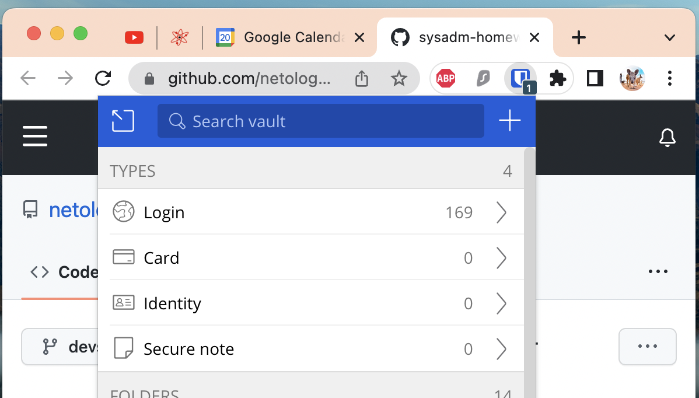
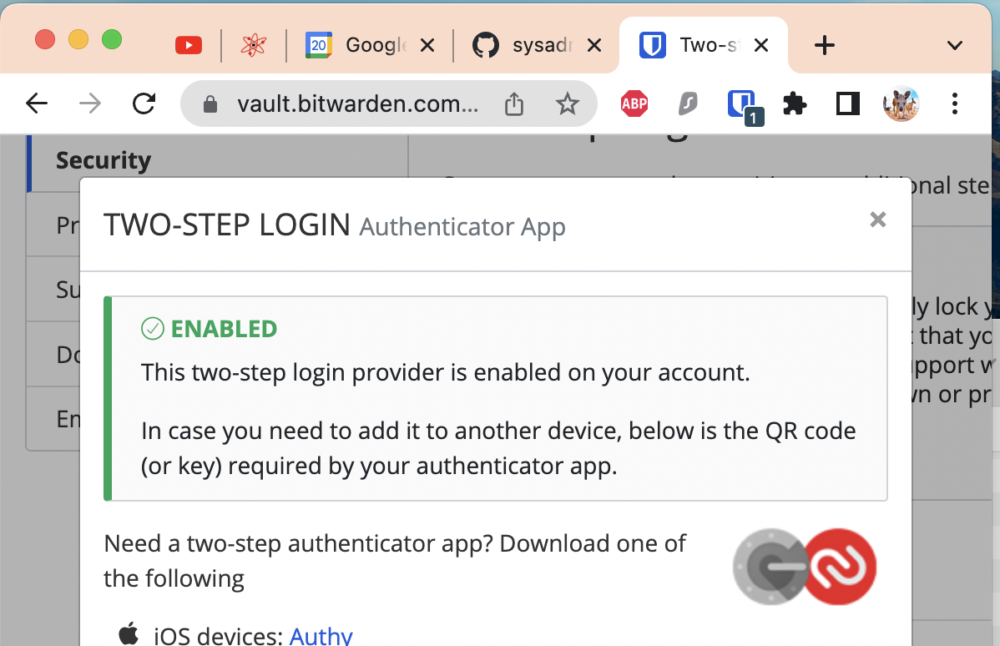
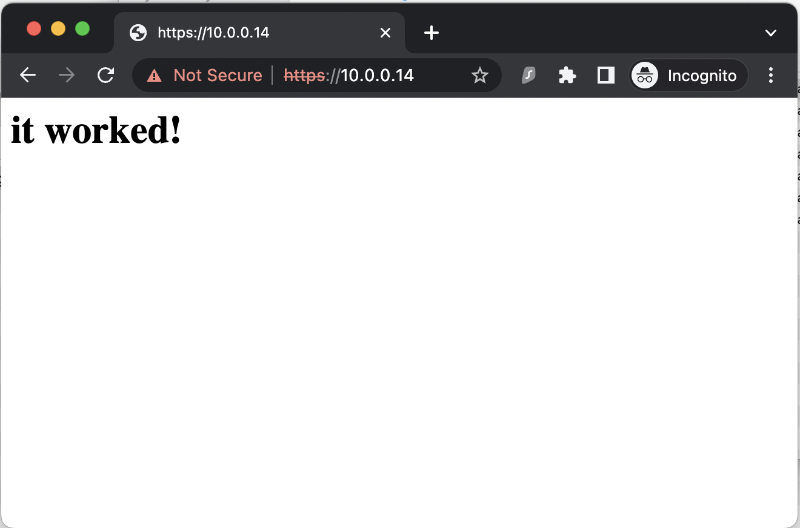
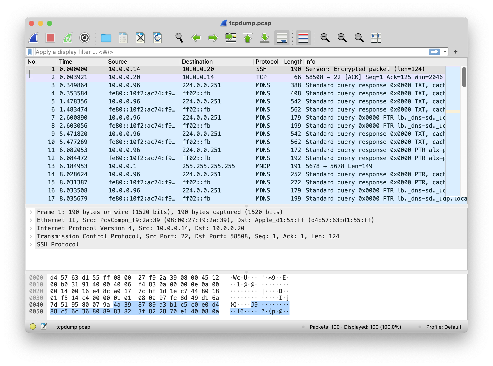

# Домашнее задание к занятию "3.9. Элементы безопасности информационных систем"

> 1. Установите Bitwarden плагин для браузера. Зарегестрируйтесь и сохраните несколько паролей.

> 2. Установите Google authenticator на мобильный телефон. Настройте вход в Bitwarden акаунт через Google authenticator OTP.

> 3. Установите apache2, сгенерируйте самоподписанный сертификат, настройте тестовый сайт для работы по HTTPS.
 

> 4. Проверьте на TLS уязвимости произвольный сайт в интернете (кроме сайтов МВД, ФСБ, МинОбр, НацБанк, РосКосмос, РосАтом, РосНАНО и любых госкомпаний, объектов КИИ, ВПК ... и тому подобное).

    vagrant@vm-1:~/testssl.sh$ ./testssl.sh -U --sneaky https://netology.ru/
    
    ###########################################################
    testssl.sh       3.1dev from https://testssl.sh/dev/
    (88e80d2 2022-07-02 22:13:06)
    
          This program is free software. Distribution and
                 modification under GPLv2 permitted.
          USAGE w/o ANY WARRANTY. USE IT AT YOUR OWN RISK!
    
           Please file bugs @ https://testssl.sh/bugs/
    
    ###########################################################
    
    Using "OpenSSL 1.0.2-chacha (1.0.2k-dev)" [~183 ciphers]
    on vm-1:./bin/openssl.Linux.x86_64
    (built: "Jan 18 17:12:17 2019", platform: "linux-x86_64")
    
    
    Start 2022-07-24 13:27:45        -->> 188.114.98.171:443 (netology.ru) <<--
    
    Further IP addresses:   2a06:98c1:3123:a000::b
    rDNS (188.114.98.171):  --
    Service detected:       HTTP
    
    
    Testing vulnerabilities
    
    Heartbleed (CVE-2014-0160)                not vulnerable (OK), no heartbeat extension
    CCS (CVE-2014-0224)                       not vulnerable (OK)
    Ticketbleed (CVE-2016-9244), experiment.  not vulnerable (OK), no session tickets
    ROBOT                                     not vulnerable (OK)
    Secure Renegotiation (RFC 5746)           OpenSSL handshake didn't succeed
    Secure Client-Initiated Renegotiation     not vulnerable (OK)
    CRIME, TLS (CVE-2012-4929)                not vulnerable (OK)
    BREACH (CVE-2013-3587)                    potentially NOT ok, "gzip" HTTP compression detected. - only supplied "/" tested
    Can be ignored for static pages or if no secrets in the page
    POODLE, SSL (CVE-2014-3566)               not vulnerable (OK)
    TLS_FALLBACK_SCSV (RFC 7507)              Downgrade attack prevention supported (OK)
    SWEET32 (CVE-2016-2183, CVE-2016-6329)    VULNERABLE, uses 64 bit block ciphers
    FREAK (CVE-2015-0204)                     not vulnerable (OK)
    DROWN (CVE-2016-0800, CVE-2016-0703)      not vulnerable on this host and port (OK)
    make sure you don't use this certificate elsewhere with SSLv2 enabled services, see
    https://search.censys.io/search?resource=hosts&virtual_hosts=INCLUDE&q=A3C7D9A8D3805171D99EA61F5C80B8ADF49B93BA21EBB492D78512BA254E90A5
    LOGJAM (CVE-2015-4000), experimental      not vulnerable (OK): no DH EXPORT ciphers, no DH key detected with <= TLS 1.2
    BEAST (CVE-2011-3389)                     TLS1: ECDHE-RSA-AES128-SHA AES128-SHA ECDHE-RSA-AES256-SHA AES256-SHA DES-CBC3-SHA
    VULNERABLE -- but also supports higher protocols  TLSv1.1 TLSv1.2 (likely mitigated)
    LUCKY13 (CVE-2013-0169), experimental     potentially VULNERABLE, uses cipher block chaining (CBC) ciphers with TLS. Check patches
    Winshock (CVE-2014-6321), experimental    not vulnerable (OK)
    RC4 (CVE-2013-2566, CVE-2015-2808)        no RC4 ciphers detected (OK)
    
    
    Done 2022-07-24 13:28:27 [  43s] -->> 188.114.98.171:443 (netology.ru) <<--

> 5. Установите на Ubuntu ssh сервер, сгенерируйте новый приватный ключ. Скопируйте свой публичный ключ на другой сервер. Подключитесь к серверу по SSH-ключу.

Создание ключа:

    vagrant@vm-1:~$ ssh-keygen
    Generating public/private rsa key pair.
    Enter file in which to save the key (/home/vagrant/.ssh/id_rsa):
    Enter passphrase (empty for no passphrase):
    Enter same passphrase again:
    Your identification has been saved in /home/vagrant/.ssh/id_rsa
    Your public key has been saved in /home/vagrant/.ssh/id_rsa.pub
    The key fingerprint is:
    SHA256:6/U2PIdtddmA7aj8axdGVpxFBWS8/EYE7YrgMGX8rpY vagrant@vm-1
    The key's randomart image is:
    +---[RSA 3072]----+
    |         .   o=*B|
    |          +  ...=|
    |         o . + = |
    |        o . o B o|
    |        S+ o * =o|
    |         .. + =.*|
    |        ...= + +.|
    |       . .E.B =  |
    |        .. ++B   |
    +----[SHA256]-----+

Копирование на другую виртуальную машину:

    vagrant@vm-1:~$ ssh-copy-id vagrant@10.0.0.11
    /usr/bin/ssh-copy-id: INFO: Source of key(s) to be installed: "/home/vagrant/.ssh/id_rsa.pub"
    The authenticity of host '10.0.0.11 (10.0.0.11)' can't be established.
    ECDSA key fingerprint is SHA256:8Lb/tKqeyNQllMhaDRbn8d8aX/ef6T2IkQ5EWnKa01s.
    Are you sure you want to continue connecting (yes/no/[fingerprint])? yes
    /usr/bin/ssh-copy-id: INFO: attempting to log in with the new key(s), to filter out any that are already installed
    /usr/bin/ssh-copy-id: INFO: 1 key(s) remain to be installed -- if you are prompted now it is to install the new keys
    vagrant@10.0.0.11's password:
    
    Number of key(s) added: 1
    
    Now try logging into the machine, with:   "ssh 'vagrant@10.0.0.11'"
    and check to make sure that only the key(s) you wanted were added.

Подключение:

    vagrant@vm-1:~$ ssh vagrant@10.0.0.11
    Welcome to Ubuntu 20.04.4 LTS (GNU/Linux 5.4.0-110-generic x86_64)

    * Documentation:  https://help.ubuntu.com
    * Management:     https://landscape.canonical.com
    * Support:        https://ubuntu.com/advantage

    System information as of Sun 24 Jul 2022 01:04:47 PM UTC
    
    System load:  0.0                Processes:             121
    Usage of /:   12.2% of 30.63GB   Users logged in:       1
    Memory usage: 21%                IPv4 address for eth0: 10.0.2.15
    Swap usage:   0%                 IPv4 address for eth1: 10.0.0.11
    
    
    This system is built by the Bento project by Chef Software
    More information can be found at https://github.com/chef/bento
    Last login: Sun Jul 24 12:52:44 2022 from 10.0.0.20

> 6. Переименуйте файлы ключей из задания 5. Настройте файл конфигурации SSH клиента, так чтобы вход на удаленный сервер осуществлялся по имени сервера.

    vagrant@vm-1:~$ mv /home/vagrant/.ssh/id_rsa /home/vagrant/.ssh/id2_rsa
    vagrant@vm-1:~$ nano .ssh/config
    
    Host node-1
    User vagrant
    HostName 10.0.0.11
    Port 22
    IdentityFile ~/.ssh/id2_rsa

Подключение по заданному имени:

    vagrant@vm-1:~$ ssh node-1
    Welcome to Ubuntu 20.04.4 LTS (GNU/Linux 5.4.0-110-generic x86_64)

    * Documentation:  https://help.ubuntu.com
    * Management:     https://landscape.canonical.com
    * Support:        https://ubuntu.com/advantage

    System information as of Sun 24 Jul 2022 01:34:12 PM UTC

    System load:  0.03               Processes:             121
    Usage of /:   12.2% of 30.63GB   Users logged in:       1
    Memory usage: 21%                IPv4 address for eth0: 10.0.2.15
    Swap usage:   0%                 IPv4 address for eth1: 10.0.0.11
    
    
    This system is built by the Bento project by Chef Software
    More information can be found at https://github.com/chef/bento
    Last login: Sun Jul 24 13:04:48 2022 from 10.0.0.14

> 7. Соберите дамп трафика утилитой tcpdump в формате pcap, 100 пакетов. Откройте файл pcap в Wireshark.

    vagrant@vm-1:~$ sudo tcpdump -c 100 -w tcpdump.pcap -i eth1
    tcpdump: listening on eth1, link-type EN10MB (Ethernet), capture size 262144 bytes
    100 packets captured
    102 packets received by filter
    0 packets dropped by kernel

