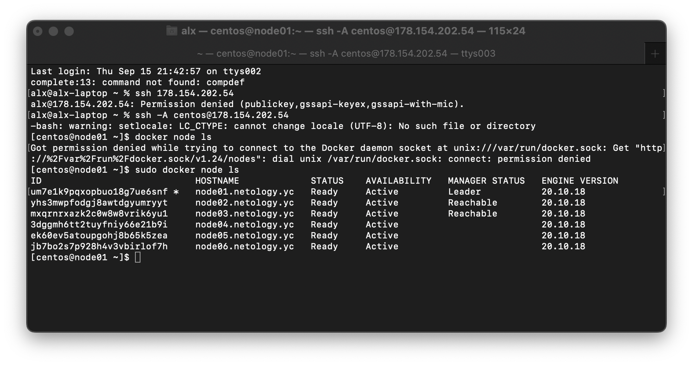
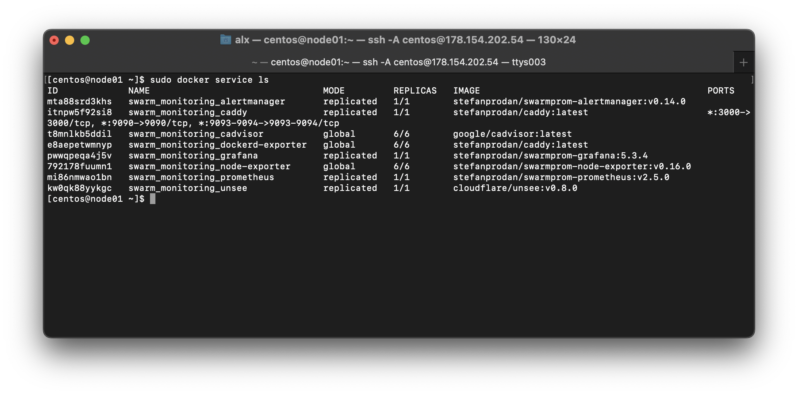
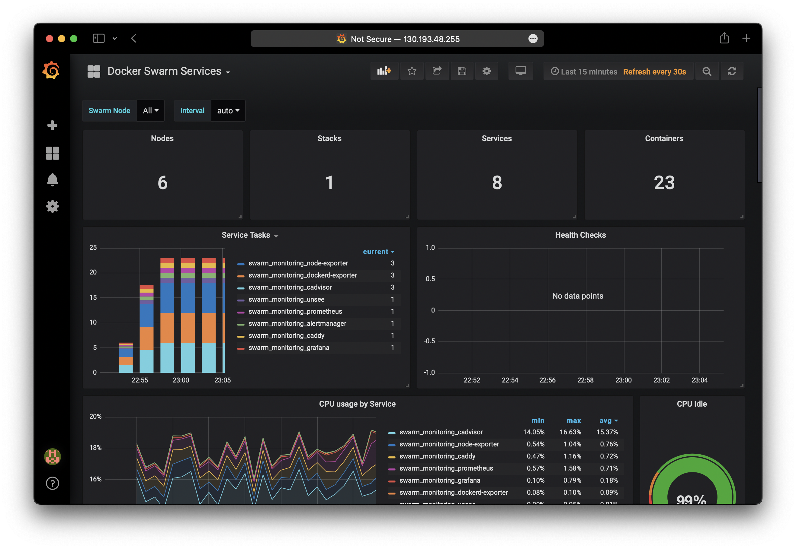

# Домашнее задание к занятию "5.5. Оркестрация кластером Docker контейнеров на примере Docker Swarm"

## Задача 1

Дайте письменые ответы на следующие вопросы:

- В чём отличие режимов работы сервисов в Docker Swarm кластере: replication и global?
- Какой алгоритм выбора лидера используется в Docker Swarm кластере?
- Что такое Overlay Network?

### Ответ

Replicated - указывается количество необходимых реплик сервиса и Docker автоматически решает на каких нодах их запустить.
Global - на каждой ноде запускается одна реплика.

Выбор лидера выполняется по алгоритму консенсуса. Если лидер становится недоступным (отключен), то любой другой менеджер может взять на себя роль лидера.
Если менеджер возвращается в сеть, то он не становится лидером, но может быть им назначен при выходе из строя текущего.

Overlay Network - любая сеть построенная поверх другой сети.

## Задача 2

Создать ваш первый Docker Swarm кластер в Яндекс.Облаке

Для получения зачета, вам необходимо предоставить скриншот из терминала (консоли), с выводом команды:
```
docker node ls
```
### Ответ



## Задача 3

Создать ваш первый, готовый к боевой эксплуатации кластер мониторинга, состоящий из стека микросервисов.

Для получения зачета, вам необходимо предоставить скриншот из терминала (консоли), с выводом команды:
```
docker service ls
```
### Ответ




