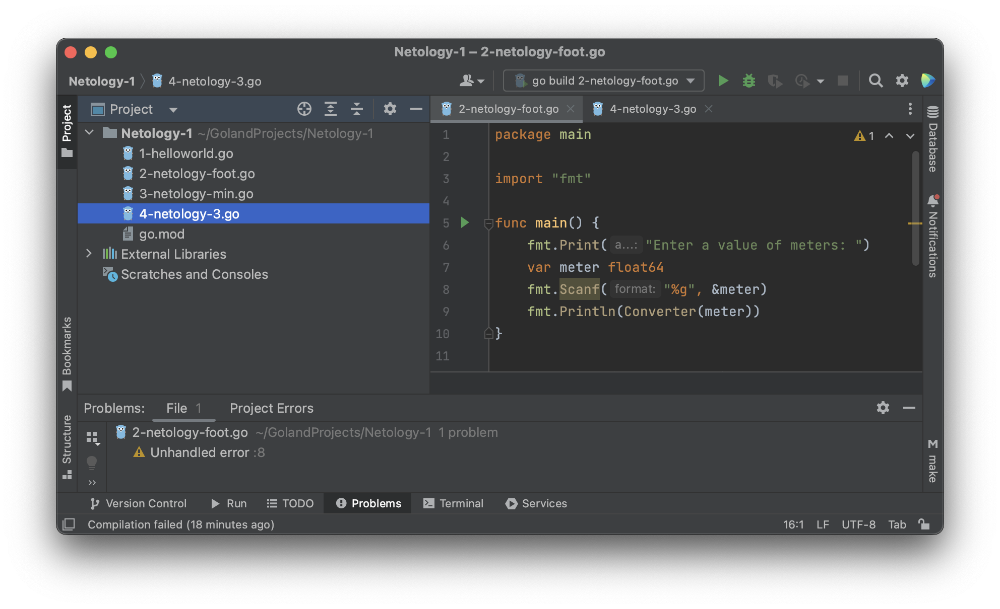

# Домашнее задание к занятию "7.5. Основы golang"

С `golang` в рамках курса, мы будем работать не много, поэтому можно использовать любой IDE.
Но рекомендуем ознакомиться с [GoLand](https://www.jetbrains.com/ru-ru/go/).  

## Задача 1. Установите golang.
1. Воспользуйтесь инструкцией с официального сайта: [https://golang.org/](https://golang.org/).
2. Так же для тестирования кода можно использовать песочницу: [https://play.golang.org/](https://play.golang.org/).

### Ответ:
Установил GoLand.



## Задача 2. Знакомство с gotour.
У Golang есть обучающая интерактивная консоль [https://tour.golang.org/](https://tour.golang.org/).
Рекомендуется изучить максимальное количество примеров. В консоли уже написан необходимый код,
осталось только с ним ознакомиться и поэкспериментировать как написано в инструкции в левой части экрана.  

### Ответ:

Прошел некоторое количество.

## Задача 3. Написание кода.
Цель этого задания закрепить знания о базовом синтаксисе языка. Можно использовать редактор кода
на своем компьютере, либо использовать песочницу: [https://play.golang.org/](https://play.golang.org/).

1. Напишите программу для перевода метров в футы (1 фут = 0.3048 метр). Можно запросить исходные данные
у пользователя, а можно статически задать в коде.
    Для взаимодействия с пользователем можно использовать функцию `Scanf`:
    ```go
    package main

    import "fmt"

    func main() {
    	fmt.Print("Enter a value of meters: ")
    	var meter float64
    	fmt.Scanf("%g", &meter)
    	fmt.Println(Converter(meter))
    }

    func Converter(meter float64) float64 {
    	var foot = meter / 3.28
    	return foot
    }
    ```

1. Напишите программу, которая найдет наименьший элемент в любом заданном списке, например:
    ```
    x := []int{48,96,86,68,57,82,63,70,37,34,83,27,19,97,9,17,}
    ```
1. Напишите программу, которая выводит числа от 1 до 100, которые делятся на 3. То есть `(3, 6, 9, …)`.

В виде решения ссылку на код или сам код.

### Ответ:

1. Программа перевода метров в футы.

```go
package main

import "fmt"

func main() {
	fmt.Print("Meter: ")
	var input float64
	fmt.Scanf("%f", &input)

	output := input / 3.28

	fmt.Print(input, "m = ", output, "ft")
}
```

2. Программа определения минимального значения.

```go
package main

import "fmt"

func main() {
	arr := []int{48, 96, 86, 68, 57, 82, 63, 70, 37, 34, 83, 27, 19, 97, 9, 17}
	fmt.Println("Min = ", Min(arr))
}

func Min(arr []int) int {
	min := arr[0]
	for _, value := range arr {
		if value < min {
			min = value
		}
	}
	return min
}
```

3. Программа вывода кратных значений.

 ```go
 package main

import (
	"fmt"
)

func main() {
	fmt.Println(Multiply(0, 100, 3))
}

func Multiply(from int, to int, factor int) []int {
	var arr []int
	for i := from; i <= to; i++ {
		if i%factor == 0 {
			arr = append(arr, i)
		}
	}
	return arr
}
```

## Задача 4. Протестировать код (не обязательно).

Создайте тесты для функций из предыдущего задания.

---

### Как cдавать задание

Выполненное домашнее задание пришлите ссылкой на .md-файл в вашем репозитории.

---
