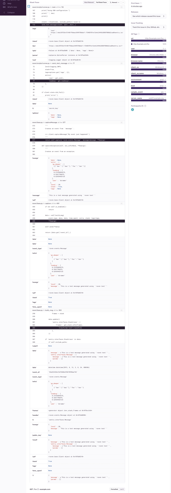

# Домашнее задание к занятию "16.Платформа мониторинга Sentry"

## Задание 1

Так как self-hosted Sentry довольно требовательная к ресурсам система, мы будем использовать Free cloud аккаунт.

Free cloud account имеет следующие ограничения:

- 5 000 errors
- 10 000 transactions
- 1 GB attachments

Для подключения Free cloud account:

- зайдите на sentry.io
- нажжмите "Try for free"
- используйте авторизацию через ваш github-account
- далее следуйте инструкциям

Для выполнения задания - пришлите скриншот меню Projects.

### Ответ


## Задание 2

Создайте python проект и нажмите `Generate sample event` для генерации тестового события.

Изучите информацию, представленную в событии.

Перейдите в список событий проекта, выберите созданное вами и нажмите `Resolved`.

Для выполнения задание предоставьте скриншот `Stack trace` из этого события и список событий проекта,
после нажатия `Resolved`.

### Ответ




## Задание 3

Перейдите в создание правил алёртинга.

Выберите проект и создайте дефолтное правило алёртинга, без настройки полей.

Снова сгенерируйте событие `Generate sample event`.

Если всё было выполнено правильно - через некоторое время, вам на почту, привязанную к github аккаунту придёт
оповещение о произошедшем событии.

Если сообщение не пришло - проверьте настройки аккаунта Sentry (например привязанную почту), что у вас не было
`sample issue` до того как вы его сгенерировали и то, что правило алёртинга выставлено по дефолту (во всех полях all).
Также проверьте проект в котором вы создаёте событие, возможно алёрт привязан к другому.

Для выполнения задания - пришлите скриншот тела сообщения из оповещения на почте.

Дополнительно поэкспериментируйте с правилами алёртинга.
Выбирайте разные условия отправки и создавайте sample events.

### Ответ


## Задание повышенной сложности

Создайте проект на ЯП python или GO (небольшой, буквально 10-20 строк), подключите к нему sentry SDK и отправьте несколько тестовых событий.
Поэкспериментируйте с различными передаваемыми параметрами, но помните об ограничениях free учетной записи cloud Sentry.

Для выполнения задания пришлите скриншот меню issues вашего проекта и
пример кода подключения sentry sdk/отсылки событий.

### Ответ


Пример приложения с ошибкой:

```py
import sentry_sdk

# Configure the Sentry SDK with your DSN
sentry_sdk.init("https://53ad9fcbd7b148f3b112b070381ea9fe@o4504684634001824.ingest.sentry.io/4504384657508652")

# Define a function that will throw an error
def function_that_fails():
    raise ValueError("Something went wrong")

# Call the function and capture any errors with Sentry
try:
    function_that_fails()
except Exception as e:
    sentry_sdk.capture_exception(e)

# Print a success message
print("The Sentry SDK is working!")
```
