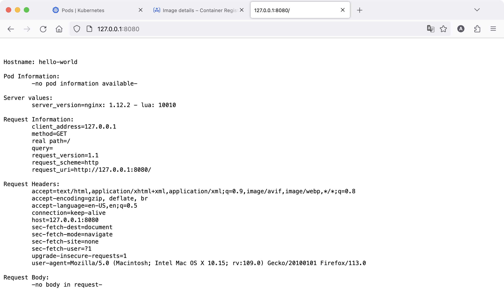
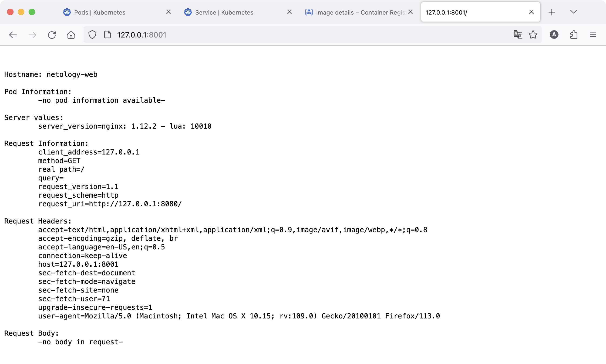

# Домашнее задание к занятию «Базовые объекты K8S»

### Цель задания

В тестовой среде для работы с Kubernetes, установленной в предыдущем ДЗ, необходимо развернуть Pod с приложением и подключиться к нему со своего локального компьютера.

------

### Чеклист готовности к домашнему заданию

1. Установленное k8s-решение (например, MicroK8S).
2. Установленный локальный kubectl.
3. Редактор YAML-файлов с подключенным Git-репозиторием.

------

### Инструменты и дополнительные материалы, которые пригодятся для выполнения задания

1. Описание [Pod](https://kubernetes.io/docs/concepts/workloads/pods/) и примеры манифестов.
2. Описание [Service](https://kubernetes.io/docs/concepts/services-networking/service/).

------

### Задание 1. Создать Pod с именем hello-world

1. Создать манифест (yaml-конфигурацию) Pod.
2. Использовать image - gcr.io/kubernetes-e2e-test-images/echoserver:2.2.
3. Подключиться локально к Pod с помощью `kubectl port-forward` и вывести значение (curl или в браузере).

### Ответ

[Конфигурация pod](hello-world.yaml):

```yaml
apiVersion: v1
kind: Pod
metadata:
  name: hello-world
  labels:
    app: echoserver
spec:
  containers:
  - name: echoserver-arm-container
    image: gcr.io/kubernetes-e2e-test-images/echoserver-arm:2.2
    ports:
    - containerPort: 8080
```

Создание pod:

`kubectl apply -f hello-world.yaml`

Получение доступа локально:

`kubectl port-forward pod/hello-world 8080:8080`



------

### Задание 2. Создать Service и подключить его к Pod

1. Создать Pod с именем netology-web.
2. Использовать image — gcr.io/kubernetes-e2e-test-images/echoserver:2.2.
3. Создать Service с именем netology-svc и подключить к netology-web.
4. Подключиться локально к Service с помощью `kubectl port-forward` и вывести значение (curl или в браузере).

### Ответ

[Конфигурация pod](netology-web.yaml):

```yaml
apiVersion: v1
kind: Pod
metadata:
  name: netology-web
  labels:
    app: netology-web
spec:
  containers:
  - name: echoserver-arm-container
    image: gcr.io/kubernetes-e2e-test-images/echoserver-arm:2.2
    ports:
    - containerPort: 8080
```

[Конфигурация сервиса](netology-svc.yaml):

```yaml
apiVersion: v1
kind: Service
metadata:
  name: netology-svc
spec:
  selector:
    app: netology-web
  ports:
  - name: http
    port: 80
    targetPort: 8080
  type: NodePort
```

Создание сервиса:

`kubectl apply -f netology-svc.yaml`

Создание pod:

`kubectl apply -f netology-web.yaml`

Получение доступа к порту сервиса локально:

`kubectl port-forward pod/hello-world 8001:80`



Вывод команды `kubectl get pods`:


Удаление сервиса и pod'ов:

```
kubectl delete pods hello-world
kubectl delete pods netology-web
kubectl delete services netology-svc
```

------

### Правила приёма работы

1. Домашняя работа оформляется в своем Git-репозитории в файле README.md. Выполненное домашнее задание пришлите ссылкой на .md-файл в вашем репозитории.
2. Файл README.md должен содержать скриншоты вывода команд `kubectl get pods`, а также скриншот результата подключения.
3. Репозиторий должен содержать файлы манифестов и ссылки на них в файле README.md.

------

### Критерии оценки

Зачёт — выполнены все задания, ответы даны в развернутой форме, приложены соответствующие скриншоты и файлы проекта, в выполненных заданиях нет противоречий и нарушения логики.

На доработку — задание выполнено частично или не выполнено, в логике выполнения заданий есть противоречия, существенные недостатки.
