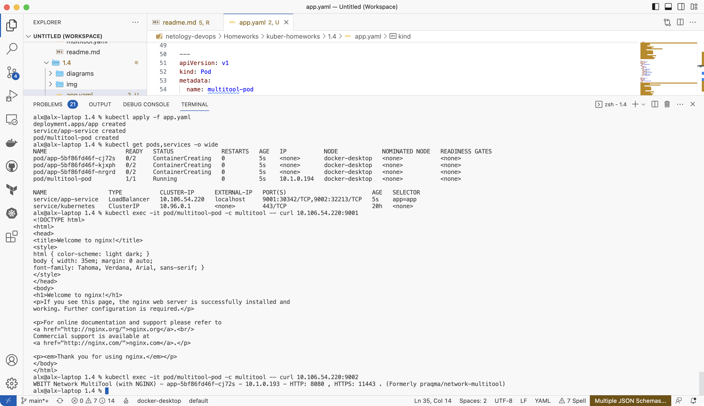
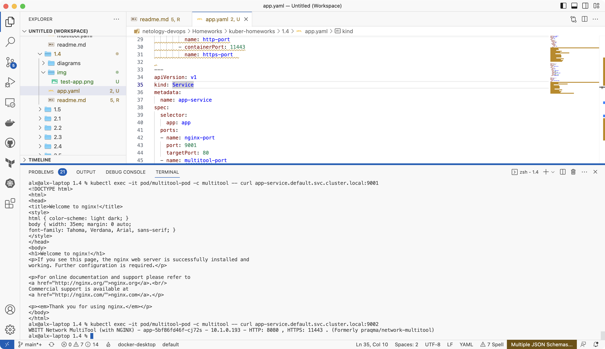

# Домашнее задание к занятию «Сетевое взаимодействие в K8S. Часть 1»

### Цель задания

В тестовой среде Kubernetes необходимо обеспечить доступ к приложению, установленному в предыдущем ДЗ и состоящему из двух контейнеров, по разным портам в разные контейнеры как внутри кластера, так и снаружи.

------

### Чеклист готовности к домашнему заданию

1. Установленное k8s-решение (например, MicroK8S).
2. Установленный локальный kubectl.
3. Редактор YAML-файлов с подключённым Git-репозиторием.

------

### Инструменты и дополнительные материалы, которые пригодятся для выполнения задания

1. [Описание](https://kubernetes.io/docs/concepts/workloads/controllers/deployment/) Deployment и примеры манифестов.
2. [Описание](https://kubernetes.io/docs/concepts/services-networking/service/) Описание Service.
3. [Описание](https://github.com/wbitt/Network-MultiTool) Multitool.

------

### Задание 1. Создать Deployment и обеспечить доступ к контейнерам приложения по разным портам из другого Pod внутри кластера

1. Создать Deployment приложения, состоящего из двух контейнеров (nginx и multitool), с количеством реплик 3 шт.
2. Создать Service, который обеспечит доступ внутри кластера до контейнеров приложения из п.1 по порту 9001 — nginx 80, по 9002 — multitool 8080.
3. Создать отдельный Pod с приложением multitool и убедиться с помощью `curl`, что из пода есть доступ до приложения из п.1 по разным портам в разные контейнеры.
4. Продемонстрировать доступ с помощью `curl` по доменному имени сервиса.
5. Предоставить манифесты Deployment и Service в решении, а также скриншоты или вывод команды п.4.

### Ответ

1. Манифест приложения с контейнерами nginx и multitool с тремя репликами:

```yaml
apiVersion: apps/v1
kind: Deployment
metadata:
  name: app
spec:
  replicas: 3
  selector:
    matchLabels:
      app: app
  template:
    metadata:
      labels:
        app: app
    spec:
      containers:
      - name: nginx
        image: nginx
        ports:
        - containerPort: 80
      - name: multitool
        image: wbitt/network-multitool:latest
        env:
        - name: HTTP_PORT
          value: "8080"   
        - name: HTTPS_PORT
          value: "11443"  
        ports:
        - containerPort: 8080   
          name: http-port
        - containerPort: 11443
          name: https-port  
```

2. Добавлен service для обеспечения доступа внутри кластера к контейнерам nginx и multitool по портам 9001 и 9002:

```yaml
---
apiVersion: v1
kind: Service
metadata:
  name: app-service
spec:
  selector:
    app: app
  ports:
  - name: nginx-port
    port: 9001
    targetPort: 80
  - name: multitool-port
    port: 9002
    targetPort: 8080
  type: LoadBalancer
```

3. Создан отдельный pod с приложением multitool:

```yaml
---
apiVersion: v1
kind: Pod
metadata:
  name: multitool-pod
spec:
  containers:
  - name: multitool
    image: wbitt/network-multitool:latest
    env:
    - name: HTTP_PORT
      value: "1180"   
    - name: HTTPS_PORT
      value: "11443"  
    ports:
    - containerPort: 1180   
      name: http-port
    - containerPort: 11443
      name: https-port  
    command: [ "/bin/bash", "-ce", "tail -f /dev/null" ]
```

Проверка доступности контейнеров приложения:



4. Проверка доступа по имени сервиса:

`kubectl exec -it pod/multitool-pod -c multitool -- curl app-service.default.svc.cluster.local:9001`



5. [Итоговый манифест](app.yaml).

------

### Задание 2. Создать Service и обеспечить доступ к приложениям снаружи кластера

1. Создать отдельный Service приложения из Задания 1 с возможностью доступа снаружи кластера к nginx, используя тип NodePort.
2. Продемонстрировать доступ с помощью браузера или `curl` с локального компьютера.
3. Предоставить манифест и Service в решении, а также скриншоты или вывод команды п.2.

### Ответ

1. Добавлен Service в манифест приложения:

```yaml
---
apiVersion: v1
kind: Service
metadata:
  name: nginx-service
spec:
  type: NodePort
  selector:
    app: app
  ports:
    - name: http
      protocol: TCP
      port: 80
      targetPort: 80
    - name: https
      protocol: TCP
      port: 443
      targetPort: 443
```

2. Проверка доступа с локального компьютера:

`curl localhost:32199`


3. [Итоговый манифест](app.yaml).

------

### Правила приёма работы

1. Домашняя работа оформляется в своем Git-репозитории в файле README.md. Выполненное домашнее задание пришлите ссылкой на .md-файл в вашем репозитории.
2. Файл README.md должен содержать скриншоты вывода необходимых команд `kubectl` и скриншоты результатов.
3. Репозиторий должен содержать тексты манифестов или ссылки на них в файле README.md.
