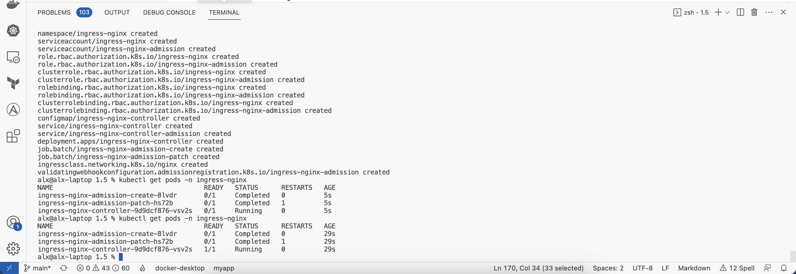

# Домашнее задание к занятию «Сетевое взаимодействие в K8S. Часть 2»

### Цель задания

В тестовой среде Kubernetes необходимо обеспечить доступ к двум приложениям снаружи кластера по разным путям.

------

### Чеклист готовности к домашнему заданию

1. Установленное k8s-решение (например, MicroK8S).
2. Установленный локальный kubectl.
3. Редактор YAML-файлов с подключённым Git-репозиторием.

------

### Инструменты и дополнительные материалы, которые пригодятся для выполнения задания

1. [Инструкция](https://microk8s.io/docs/getting-started) по установке MicroK8S.
2. [Описание](https://kubernetes.io/docs/concepts/services-networking/service/) Service.
3. [Описание](https://kubernetes.io/docs/concepts/services-networking/ingress/) Ingress.
4. [Описание](https://github.com/wbitt/Network-MultiTool) Multitool.

------

### Задание 1. Создать Deployment приложений backend и frontend

1. Создать Deployment приложения _frontend_ из образа nginx с количеством реплик 3 шт.
2. Создать Deployment приложения _backend_ из образа multitool.
3. Добавить Service, которые обеспечат доступ к обоим приложениям внутри кластера.
4. Продемонстрировать, что приложения видят друг друга с помощью Service.
5. Предоставить манифесты Deployment и Service в решении, а также скриншоты или вывод команды п.4.

------

### Ответ

1. Создан [манифест](frontend-app.yaml) с конфигурацией приложения frontend:

```yaml
apiVersion: apps/v1
kind: Deployment
metadata:
  name: frontend
spec:
  replicas: 3
  selector:
    matchLabels:
      app: frontend
  template:
    metadata:
      labels:
        app: frontend
    spec:
      containers:
      - name: nginx
        image: nginx
        ports:
        - containerPort: 80
```

2. Создан [манифест](backend-app.yaml) с конфигурацией приложения backend:

```yaml
apiVersion: apps/v1
kind: Deployment
metadata:
  name: backend
spec:
  replicas: 1
  selector:
    matchLabels:
      app: backend
  template:
    metadata:
      labels:
        app: backend
    spec:
      containers:
      - name: multitool
        image: wbitt/network-multitool:latest
        env:
        - name: HTTP_PORT
          value: "1180"   
        - name: HTTPS_PORT
          value: "11443"  
        ports:
        - containerPort: 1180   
          name: http-port
        - containerPort: 11443
          name: https-port  
```

3. Каждому приложению добавлен Service для доступа внутри кластера.

[frontend-service](frontend-app.yaml):

```yaml
---
apiVersion: v1
kind: Service
metadata:
  name: frontend-service
spec:
  type: ClusterIP
  selector:
    app: frontend
  ports:
    - name: http
      port: 80
      targetPort: 80
```

[backend-service](backend-app.yaml):

```yaml
---
apiVersion: v1
kind: Service
metadata:
  name: backend-service
spec:
  type: ClusterIP
  selector:
    app: backend
  ports:
    - name: http
      port: 80
      targetPort: 1180
```

4. Демонстрация доступности сервисов друг для друга:

```shell
kubectl exec pod/frontend-59cb7b6bf6-7vr6w -- curl backend-service:80
kubectl exec pod/backend-9bd669896-kjbk7 -- curl frontend-service:80
```


### Задание 2. Создать Ingress и обеспечить доступ к приложениям снаружи кластера

1. Включить Ingress-controller в MicroK8S.
2. Создать Ingress, обеспечивающий доступ снаружи по IP-адресу кластера MicroK8S так, чтобы при запросе только по адресу открывался _frontend_ а при добавлении /api - _backend_.
3. Продемонстрировать доступ с помощью браузера или `curl` с локального компьютера.
4. Предоставить манифесты и скриншоты или вывод команды п.2.

### Ответ

1. MicroK8S не используется. Кластер запущен в Docker Desktop на MacOS. Установлен Ingress командой:

```shell
kubectl apply -f https://raw.githubusercontent.com/kubernetes/ingress-nginx/controller-v1.8.0/deploy/static/provider/cloud/deploy.yaml
```

```shell
kubectl get pods -n ingress-nginx
```



2. Создан [манифест Ingress](ingress.yaml):

```yaml
apiVersion: networking.k8s.io/v1
kind: Ingress
metadata:
  name: backend
  annotations:
    kubernetes.io/ingress.class: nginx
    nginx.ingress.kubernetes.io/rewrite-target: /
    nginx.ingress.kubernetes.io/use-forwarded-headers: "true"
spec:
  rules:
    - host: localhost
      http:
        paths:
          - path: /
            pathType: Prefix
            backend:
              service:
                name: frontend-service
                port:
                  number: 80
          - path: /api
            pathType: Prefix
            backend:
              service:
                name: backend-service
                port:
                  number: 80
```

3. Демонстрация доступа с помощью браузера и `curl` с локального компьютера:


------

### Правила приема работы

1. Домашняя работа оформляется в своем Git-репозитории в файле README.md. Выполненное домашнее задание пришлите ссылкой на .md-файл в вашем репозитории.
2. Файл README.md должен содержать скриншоты вывода необходимых команд `kubectl` и скриншоты результатов.
3. Репозиторий должен содержать тексты манифестов или ссылки на них в файле README.md.

------
