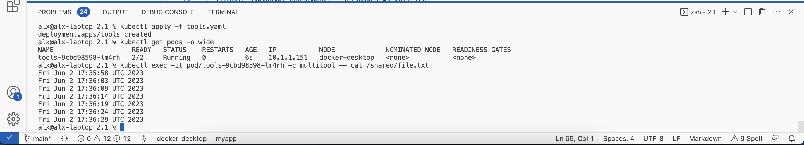
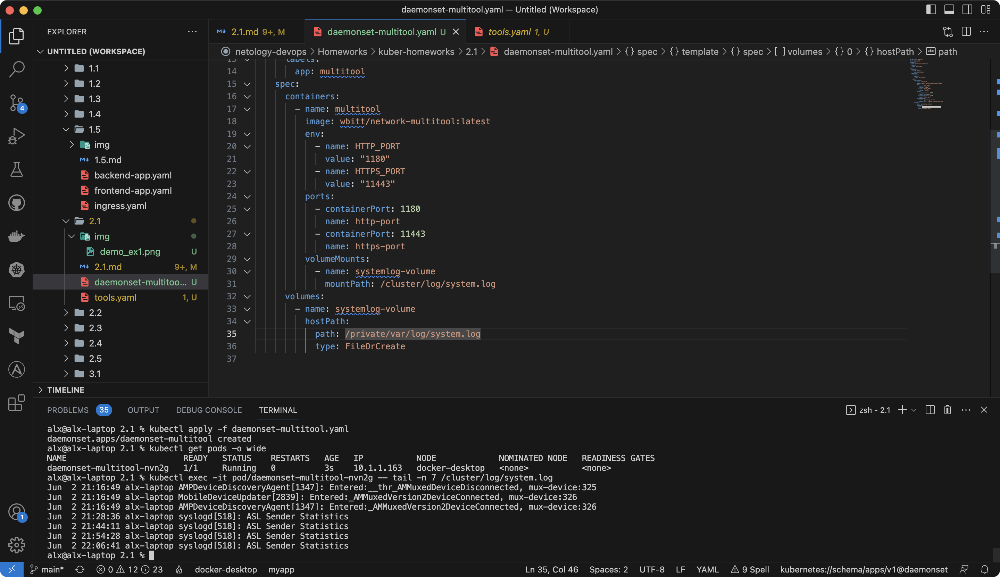

# Домашнее задание к занятию «Хранение в K8s. Часть 1»

### Цель задания

В тестовой среде Kubernetes нужно обеспечить обмен файлами между контейнерам пода и доступ к логам ноды.

------

### Чеклист готовности к домашнему заданию

1. Установленное K8s-решение (например, MicroK8S).
2. Установленный локальный kubectl.
3. Редактор YAML-файлов с подключенным GitHub-репозиторием.

------

### Дополнительные материалы для выполнения задания

1. [Инструкция по установке MicroK8S](https://microk8s.io/docs/getting-started).
2. [Описание Volumes](https://kubernetes.io/docs/concepts/storage/volumes/).
3. [Описание Multitool](https://github.com/wbitt/Network-MultiTool).

------

### Задание 1

**Что нужно сделать**

Создать Deployment приложения, состоящего из двух контейнеров и обменивающихся данными.

1. Создать Deployment приложения, состоящего из контейнеров busybox и multitool.
2. Сделать так, чтобы busybox писал каждые пять секунд в некий файл в общей директории.
3. Обеспечить возможность чтения файла контейнером multitool.
4. Продемонстрировать, что multitool может читать файл, который периодоически обновляется.
5. Предоставить манифесты Deployment в решении, а также скриншоты или вывод команды из п. 4.

### Ответ

1. Создан [манифест](tools.yaml) с конфигурацией приложения tools:

```yaml
apiVersion: apps/v1
kind: Deployment
metadata:
  name: tools
spec:
  replicas: 1
  selector:
    matchLabels:
      app: tools
  template:
    metadata:
      labels:
        app: tools
    spec:
      containers:
        - name: busybox
          image: busybox
        - name: multitool
          image: wbitt/network-multitool:latest
          env:
            - name: HTTP_PORT
              value: "1180"
            - name: HTTPS_PORT
              value: "11443"
          ports:
            - containerPort: 1180
              name: http-port
            - containerPort: 11443
              name: https-port
```

2. В контейнер busybox добавлена команда которая каждые 5 секунд записывает текущую дату и время в файл:

```yaml
command: ["/bin/sh", "-c", "while true; do echo $(date) >> /shared/file.txt; sleep 5; done"]
```

3. Для общего доступа к файлам для контейнеров создана временная директория:

```yaml
      volumes:
        - name: shared-volume
          emptyDir: {}
```

Также она указана каждому контейнеру:

```yaml
          volumeMounts:
            - name: shared-volume
              mountPath: /shared
```

4. Демонстрация доступа к файлу из контейнера multitool:



5. [Манифест](tools.yaml) деплоя.

------

### Задание 2

**Что нужно сделать**

Создать DaemonSet приложения, которое может прочитать логи ноды.

1. Создать DaemonSet приложения, состоящего из multitool.
2. Обеспечить возможность чтения файла `/var/log/syslog` кластера MicroK8S.
3. Продемонстрировать возможность чтения файла изнутри пода.
4. Предоставить манифесты Deployment, а также скриншоты или вывод команды из п. 2.

### Ответ

1. [Манифест DaemonSet'а](daemonset-multitool.yaml) состоящего из multitool:

```yaml
apiVersion: apps/v1
kind: DaemonSet
metadata:
  name: daemonset-multitool
  labels:
    app: multitool
spec:
  selector:
    matchLabels:
      app: multitool
  template:
    metadata:
      labels:
        app: multitool
    spec:
      containers:
        - name: multitool
          image: wbitt/network-multitool:latest
          env:
            - name: HTTP_PORT
              value: "1180"
            - name: HTTPS_PORT
              value: "11443"
          ports:
            - containerPort: 1180
              name: http-port
            - containerPort: 11443
              name: https-port
```

2. Для возможности доступа к файлу системных логов добавлен volume (MacOS):

```yaml
      volumes:
        - name: systemlog-volume
          hostPath:
            path: /private/var/log/system.log
            type: FileOrCreate
```

Также он указан для контейнера:

```yaml
          volumeMounts:
            - name: systemlog-volume
              mountPath: /cluster/log/system.log
```

3. Демонстрация доступа к файлу из pod'а:



4. [Манифест DaemonSet'а](daemonset-multitool.yaml).

------

### Правила приёма работы

1. Домашняя работа оформляется в своём Git-репозитории в файле README.md. Выполненное задание пришлите ссылкой на .md-файл в вашем репозитории.
2. Файл README.md должен содержать скриншоты вывода необходимых команд `kubectl`, а также скриншоты результатов.
3. Репозиторий должен содержать тексты манифестов или ссылки на них в файле README.md.

------
