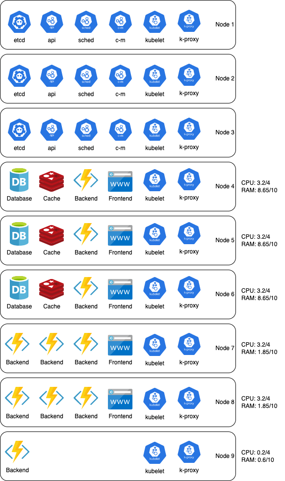

# Домашнее задание к занятию "Компоненты Kubernetes"

### Цель задания

Рассчитать требования к кластеру под проект

------

### Инструменты/ дополнительные материалы, которые пригодятся для выполнения задания

- [Considerations for large clusters](https://kubernetes.io/docs/setup/best-practices/cluster-large/)
- [Architecting Kubernetes clusters — choosing a worker node size](https://learnk8s.io/kubernetes-node-size)

------

### Задание. Необходимо определить требуемые ресурсы

Известно, что проекту нужны база данных, система кеширования, а само приложение состоит из бекенда и фронтенда. Опишите, какие ресурсы нужны, если известно:

1. Необходимо упаковать приложение в чарт для деплоя в разные окружения.
2. База данных должна быть отказоустойчивой. Потребляет 4 ГБ ОЗУ в работе, 1 ядро. 3 копии.
3. Кэш должен быть отказоустойчивый. Потребляет 4 ГБ ОЗУ в работе, 1 ядро. 3 копии.
4. Фронтенд обрабатывает внешние запросы быстро, отдавая статику. Потребляет не более 50 МБ ОЗУ на каждый экземпляр, 0.2 ядра. 5 копий.
5. Бекенд потребляет 600 МБ ОЗУ и по 1 ядру на копию. 10 копий.

### Ответ

Требования:

- База данных:
  - RAM: 4 ГБ на одну копию
  - CPU: 1 ядро на одну копию
  - Реплик: 3
- Система кеширования:
  - RAM: 4 ГБ на одну копию
  - CPU: 1 ядро на одну копию
  - Реплик: 3
- Фронтенд:
  - RAM: 50 МБ на одну копию
  - CPU: 0.2 ядра на одну копию
  - Реплик: 5
- Бекенд:
  - RAM: 600 МБ на одну копию
  - CPU: 1 ядро на одну копию
  - Реплик: 10

Используем девять нод - три для отказоустойчивости компонентов кластера Kubernetes, 6 для работы приложения и возможности распределения нагрузки в случае выхода из строя 1 ноды.

CPU: 4
RAM: 10 Gb

----

### Правила приема работы

1. Домашняя работа оформляется в своем Git репозитории в файле README.md. Выполненное домашнее задание пришлите ссылкой на .md-файл в вашем репозитории.
2. Сначала сделайте расчет всех необходимых ресурсов
3. Затем прикиньте количество рабочих нод, которые справятся с такой нагрузкой.
4. Добавьте к полученным цифрам запас, который учитывает выход из строя как минимум одной ноды.
5. Добавьте служебные ресурсы к нодам. Помните, что для разных типов нод требования к ресурсам разные.
6. В результате должно быть указано количество нод и их параметры.
