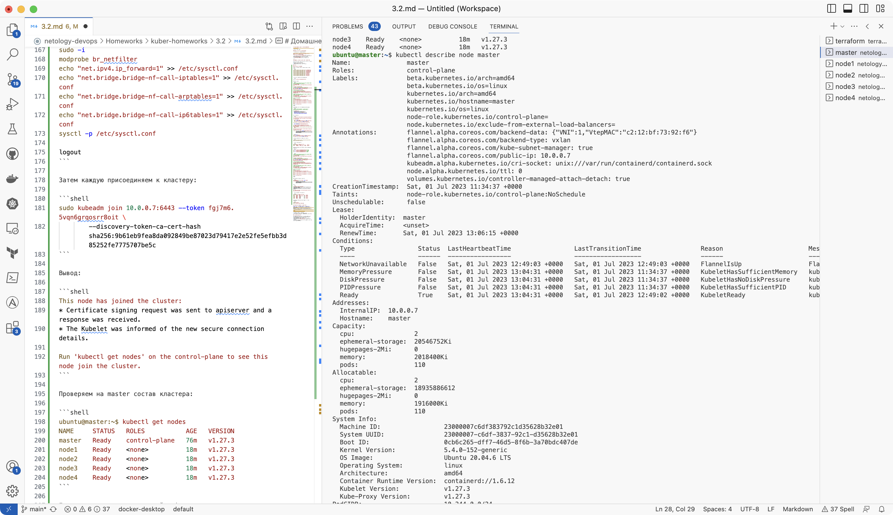
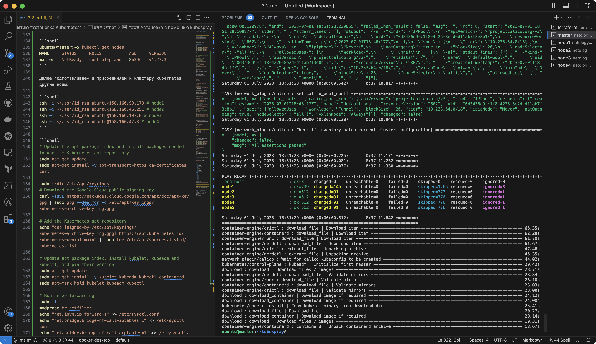
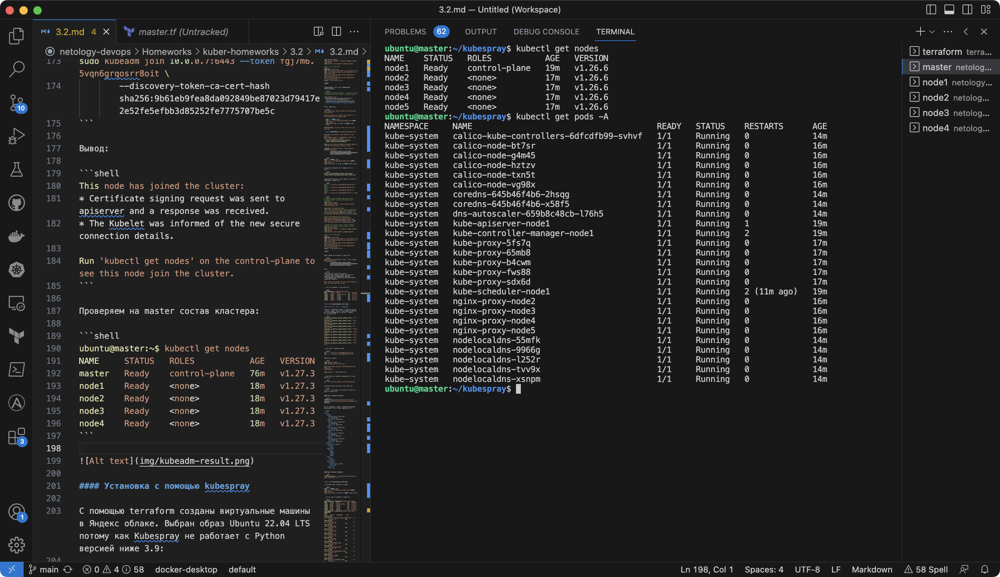

# Домашнее задание к занятию "Установка Kubernetes"

### Цель задания

Установить кластер K8s.

### Чеклист готовности к домашнему заданию

1. Развернутые ВМ с ОС Ubuntu 20.04-lts


### Инструменты и дополнительные материалы, которые пригодятся для выполнения задания

1. [Инструкция по установке kubeadm](https://kubernetes.io/docs/setup/production-environment/tools/kubeadm/create-cluster-kubeadm/)
2. [Документация kubespray](https://kubespray.io/)

-----

### Задание 1. Установить кластер k8s с 1 master node

1. Подготовка работы кластера из 5 нод: 1 мастер и 4 рабочие ноды.
2. В качестве CRI — containerd.
3. Запуск etcd производить на мастере.
4. Способ установки выбрать самостоятельно.

### Ответ

#### Установка через kubeadm

С помощью terraform созданы виртуальные машины в Яндекс облаке:

```shell
external_ip_address_master_yandex_cloud = "158.160.54.61"
external_ip_address_node1_yandex_cloud = "158.160.99.179"
external_ip_address_node2_yandex_cloud = "158.160.46.251"
external_ip_address_node3_yandex_cloud = "158.160.107.8"
external_ip_address_node4_yandex_cloud = "158.160.42.3"
internal_ip_address_master_yandex_cloud = "10.0.0.7"
internal_ip_address_node1_yandex_cloud = "10.0.0.30"
internal_ip_address_node2_yandex_cloud = "10.0.0.10"
internal_ip_address_node3_yandex_cloud = "10.0.0.38"
internal_ip_address_node4_yandex_cloud = "10.0.0.32"
```

Подключаемся к master по ssh:

```shell
ssh -i ~/.ssh/id_rsa ubuntu@158.160.54.61
```

Выполняем команды:

```shell
# Update the apt package index and install packages needed to use the Kubernetes apt repository
sudo apt-get update
sudo apt-get install -y apt-transport-https ca-certificates curl

sudo mkdir /etc/apt/keyrings
# Download the Google Cloud public signing key
curl -fsSL https://packages.cloud.google.com/apt/doc/apt-key.gpg | sudo gpg --dearmor -o /etc/apt/keyrings/kubernetes-archive-keyring.gpg

# Add the Kubernetes apt repository
echo "deb [signed-by=/etc/apt/keyrings/kubernetes-archive-keyring.gpg] https://apt.kubernetes.io/ kubernetes-xenial main" | sudo tee /etc/apt/sources.list.d/kubernetes.list

# Update apt package index, install kubelet, kubeadm and kubectl, and pin their version
sudo apt-get update
sudo apt-get install -y kubelet kubeadm kubectl containerd
sudo apt-mark hold kubelet kubeadm kubectl

# Включение forwarding
sudo -i
modprobe br_netfilter
echo "net.ipv4.ip_forward=1" >> /etc/sysctl.conf
echo "net.bridge.bridge-nf-call-iptables=1" >> /etc/sysctl.conf
echo "net.bridge.bridge-nf-call-arptables=1" >> /etc/sysctl.conf
echo "net.bridge.bridge-nf-call-ip6tables=1" >> /etc/sysctl.conf
sysctl -p /etc/sysctl.conf

logout
```

Инициализация мастер-ноды (Kubernetes control-plane):

```shell
# apiserver-advertise-address - internal node ip
# apiserver-cert-extra-sans - external node ip

sudo kubeadm init \
 --apiserver-advertise-address=10.0.0.7 \
 --pod-network-cidr 10.244.0.0/16 \
 --apiserver-cert-extra-sans=158.160.99.179
 --control-plane-endpoint=cluster_ip_address
```

Вывод результата:

```shell
Your Kubernetes control-plane has initialized successfully!

To start using your cluster, you need to run the following as a regular user:

  mkdir -p $HOME/.kube
  sudo cp -i /etc/kubernetes/admin.conf $HOME/.kube/config
  sudo chown $(id -u):$(id -g) $HOME/.kube/config

Alternatively, if you are the root user, you can run:

  export KUBECONFIG=/etc/kubernetes/admin.conf

You should now deploy a pod network to the cluster.
Run "kubectl apply -f [podnetwork].yaml" with one of the options listed at:
  https://kubernetes.io/docs/concepts/cluster-administration/addons/

Then you can join any number of worker nodes by running the following on each as root:

kubeadm join 10.0.0.7:6443 --token fgj7m6.5vqn6grqosrr8oit \
        --discovery-token-ca-cert-hash sha256:9b61eb9fea8da092849be87023d79417e2e52fe5efbb3d85252fe7775707be5c
```

```shell
mkdir -p $HOME/.kube
sudo cp -i /etc/kubernetes/admin.conf $HOME/.kube/config
sudo chown $(id -u):$(id -g) $HOME/.kube/config
```

Установка компонента для создания адресов pod'ов:

```shell
https://raw.githubusercontent.com/coreos/flannel/master/Documentation/kube-flannel.yml
```

Далее подготавливаем и присоединяем к кластеру kubernetes другие ноды:

```shell
ssh -i ~/.ssh/id_rsa ubuntu@158.160.99.179 # node1
ssh -i ~/.ssh/id_rsa ubuntu@158.160.46.251 # node2
ssh -i ~/.ssh/id_rsa ubuntu@158.160.107.8 # node3
ssh -i ~/.ssh/id_rsa ubuntu@158.160.42.3 # node4
```

```shell
# Update the apt package index and install packages needed to use the Kubernetes apt repository
sudo apt-get update
sudo apt-get install -y apt-transport-https ca-certificates curl

sudo mkdir /etc/apt/keyrings
# Download the Google Cloud public signing key
curl -fsSL https://packages.cloud.google.com/apt/doc/apt-key.gpg | sudo gpg --dearmor -o /etc/apt/keyrings/kubernetes-archive-keyring.gpg

# Add the Kubernetes apt repository
echo "deb [signed-by=/etc/apt/keyrings/kubernetes-archive-keyring.gpg] https://apt.kubernetes.io/ kubernetes-xenial main" | sudo tee /etc/apt/sources.list.d/kubernetes.list

# Update apt package index, install kubelet, kubeadm and kubectl, and pin their version
sudo apt-get update
sudo apt-get install -y kubelet kubeadm kubectl containerd
sudo apt-mark hold kubelet kubeadm kubectl

# Включение forwarding
sudo -i
modprobe br_netfilter
echo "net.ipv4.ip_forward=1" >> /etc/sysctl.conf
echo "net.bridge.bridge-nf-call-iptables=1" >> /etc/sysctl.conf
echo "net.bridge.bridge-nf-call-arptables=1" >> /etc/sysctl.conf
echo "net.bridge.bridge-nf-call-ip6tables=1" >> /etc/sysctl.conf
sysctl -p /etc/sysctl.conf

logout
```

Затем каждую присоединяем к кластеру:

```shell
sudo kubeadm join 10.0.0.7:6443 --token fgj7m6.5vqn6grqosrr8oit \
        --discovery-token-ca-cert-hash sha256:9b61eb9fea8da092849be87023d79417e2e52fe5efbb3d85252fe7775707be5c
```

Вывод:

```shell
This node has joined the cluster:
* Certificate signing request was sent to apiserver and a response was received.
* The Kubelet was informed of the new secure connection details.

Run 'kubectl get nodes' on the control-plane to see this node join the cluster.
```

Проверяем на master состав кластера:

```shell
ubuntu@master:~$ kubectl get nodes
NAME     STATUS   ROLES           AGE   VERSION
master   Ready    control-plane   76m   v1.27.3
node1    Ready    <none>          18m   v1.27.3
node2    Ready    <none>          18m   v1.27.3
node3    Ready    <none>          18m   v1.27.3
node4    Ready    <none>          18m   v1.27.3
```



#### Установка с помощью kubespray

С помощью terraform созданы виртуальные машины в Яндекс облаке. Выбран образ Ubuntu 22.04 LTS потому как Kubespray не работает с Python версией ниже 3.9:

```shell
external_ip_address_master_yandex_cloud = "62.84.118.215"
external_ip_address_node1_yandex_cloud = "158.160.54.123"
external_ip_address_node2_yandex_cloud = "84.201.174.194"
external_ip_address_node3_yandex_cloud = "51.250.73.233"
external_ip_address_node4_yandex_cloud = "62.84.119.159"
internal_ip_address_master_yandex_cloud = "10.0.0.10"
internal_ip_address_node1_yandex_cloud = "10.0.0.37"
internal_ip_address_node2_yandex_cloud = "10.0.0.23"
internal_ip_address_node3_yandex_cloud = "10.0.0.7"
internal_ip_address_node4_yandex_cloud = "10.0.0.31"
```

Подключаемся к master по ssh:

```shell
ssh -i ~/.ssh/id_rsa ubuntu@62.84.118.215
ssh -i ~/.ssh/id_rsa ubuntu@158.160.54.123
```

Выполняем команды:

```shell
sudo apt-get update -y
sudo apt-get install git pip -y

git clone https://github.com/kubernetes-sigs/kubespray
cd kubespray

pip3 install -r requirements.txt
```

После установки копируем inventory для своего кластера:

```shell
cp -rfp inventory/sample inventory/mycluster
```

Указываем ip адреса машин всего кластера:

```shell
declare -a IPS=(10.0.0.10 10.0.0.37 10.0.0.23 10.0.0.7 10.0.0.31)
```

Запускаем inventory builder:

```shell
CONFIG_FILE=inventory/mycluster/hosts.yaml python3 contrib/inventory_builder/inventory.py ${IPS[@]}
```

Вносим изменения в файл 'inventory/mycluster/hosts.yaml' для уточнения назначения нод:

```yaml
all:
  hosts:
    node1:
      ansible_host: 10.0.0.10
      ip: 10.0.0.10
      access_ip: 10.0.0.10
    node2:
      ansible_host: 10.0.0.37
      ip: 10.0.0.37
      access_ip: 10.0.0.37
    node3:
      ansible_host: 10.0.0.23
      ip: 10.0.0.23
      access_ip: 10.0.0.23
    node4:
      ansible_host: 10.0.0.7
      ip: 10.0.0.7
      access_ip: 10.0.0.7
    node5:
      ansible_host: 10.0.0.31
      ip: 10.0.0.31
      access_ip: 10.0.0.31
  children:
    kube_control_plane:
      hosts:
        node1:
    kube_node:
      hosts:
        node2:
        node3:
        node4:
        node5:
    etcd:
      hosts:
        node1:
    k8s_cluster:
      children:
        kube_control_plane:
        kube_node:
    calico_rr:
      hosts: {}
```

Запускаем Ansible Playbook:

```shell
ansible-playbook -i inventory/mycluster/hosts.yaml cluster.yml -b -v
```



После завершения выполняем команды:

```shell
mkdir -p $HOME/.kube
sudo cp -i /etc/kubernetes/admin.conf $HOME/.kube/config
sudo chown $(id -u):$(id -g) $HOME/.kube/config
```

Проверка работы компонентов кластера:

```shell
ubuntu@master:~/kubespray$ kubectl get nodes
NAME    STATUS   ROLES           AGE   VERSION
node1   Ready    control-plane   19m   v1.26.6
node2   Ready    <none>          17m   v1.26.6
node3   Ready    <none>          17m   v1.26.6
node4   Ready    <none>          17m   v1.26.6
node5   Ready    <none>          17m   v1.26.6
ubuntu@master:~/kubespray$ kubectl get pods -A
NAMESPACE     NAME                                      READY   STATUS    RESTARTS      AGE
kube-system   calico-kube-controllers-6dfcdfb99-svhvf   1/1     Running   0             14m
kube-system   calico-node-bt7sr                         1/1     Running   0             16m
kube-system   calico-node-g4m45                         1/1     Running   0             16m
kube-system   calico-node-hztzv                         1/1     Running   0             16m
kube-system   calico-node-txn5t                         1/1     Running   0             16m
kube-system   calico-node-vg98x                         1/1     Running   0             16m
kube-system   coredns-645b46f4b6-2hsqg                  1/1     Running   0             14m
kube-system   coredns-645b46f4b6-x58f5                  1/1     Running   0             14m
kube-system   dns-autoscaler-659b8c48cb-l76h5           1/1     Running   0             14m
kube-system   kube-apiserver-node1                      1/1     Running   1             19m
kube-system   kube-controller-manager-node1             1/1     Running   2             19m
kube-system   kube-proxy-5fs7q                          1/1     Running   0             17m
kube-system   kube-proxy-65mb8                          1/1     Running   0             17m
kube-system   kube-proxy-b4cwm                          1/1     Running   0             17m
kube-system   kube-proxy-fws88                          1/1     Running   0             17m
kube-system   kube-proxy-sdx6d                          1/1     Running   0             17m
kube-system   kube-scheduler-node1                      1/1     Running   2 (11m ago)   19m
kube-system   nginx-proxy-node2                         1/1     Running   0             16m
kube-system   nginx-proxy-node3                         1/1     Running   0             16m
kube-system   nginx-proxy-node4                         1/1     Running   0             16m
kube-system   nginx-proxy-node5                         1/1     Running   0             16m
kube-system   nodelocaldns-55mfk                        1/1     Running   0             14m
kube-system   nodelocaldns-9966g                        1/1     Running   0             14m
kube-system   nodelocaldns-l252r                        1/1     Running   0             14m
kube-system   nodelocaldns-tvv9x                        1/1     Running   0             14m
kube-system   nodelocaldns-xsnpm                        1/1     Running   0             14m
```



## Дополнительные задания (со звездочкой*)

**Настоятельно рекомендуем выполнять все задания под звёздочкой.**   Их выполнение поможет глубже разобраться в материале.
Задания под звёздочкой дополнительные (необязательные к выполнению) и никак не повлияют на получение вами зачета по этому домашнему заданию.

------
### Задание 2*. Установить HA кластер

1. Установить кластер в режиме HA
2. Использовать нечетное кол-во Master-node
3. Для cluster ip использовать keepalived или другой способ

### Правила приема работы

1. Домашняя работа оформляется в своем Git репозитории в файле README.md. Выполненное домашнее задание пришлите ссылкой на .md-файл в вашем репозитории.
2. Файл README.md должен содержать скриншоты вывода необходимых команд `kubectl get nodes`, а также скриншоты результатов
3. Репозиторий должен содержать тексты манифестов или ссылки на них в файле README.md
