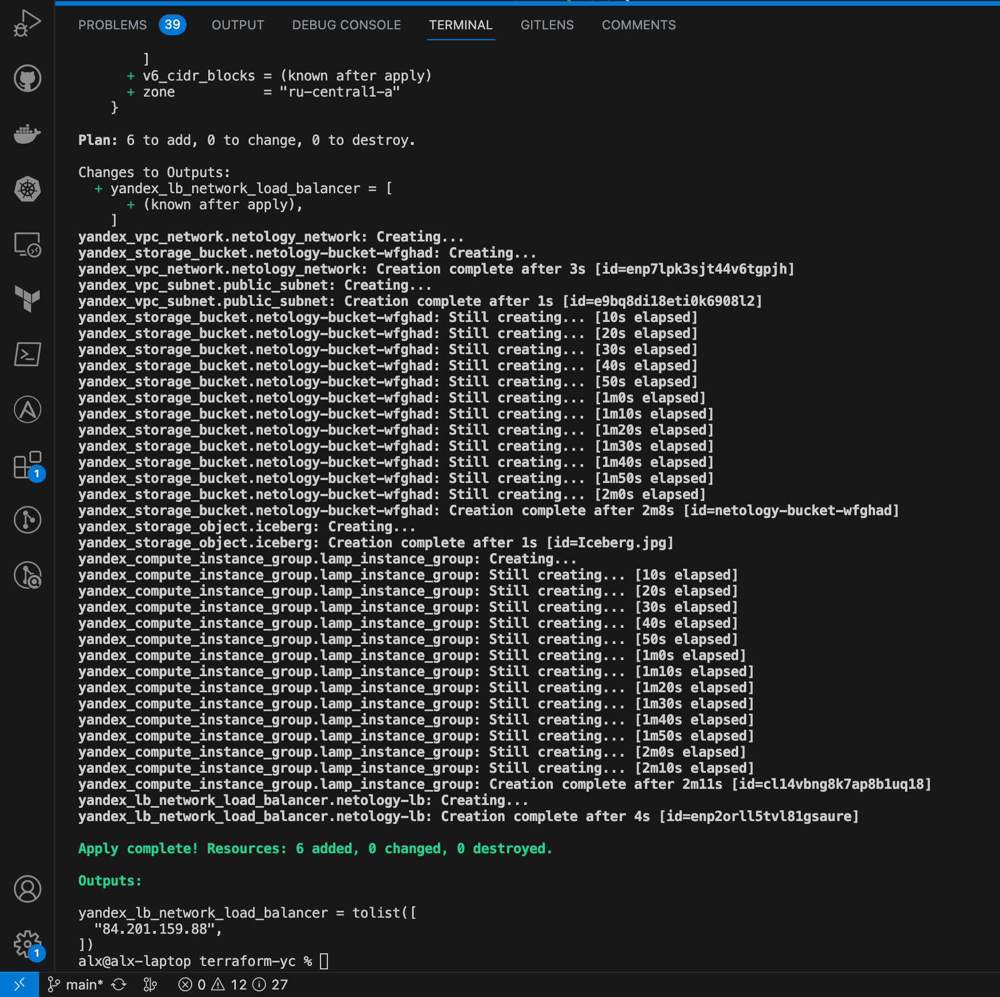
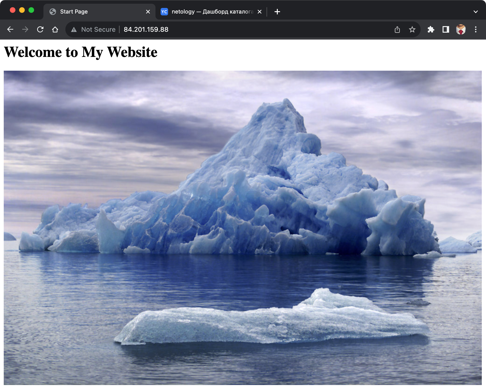
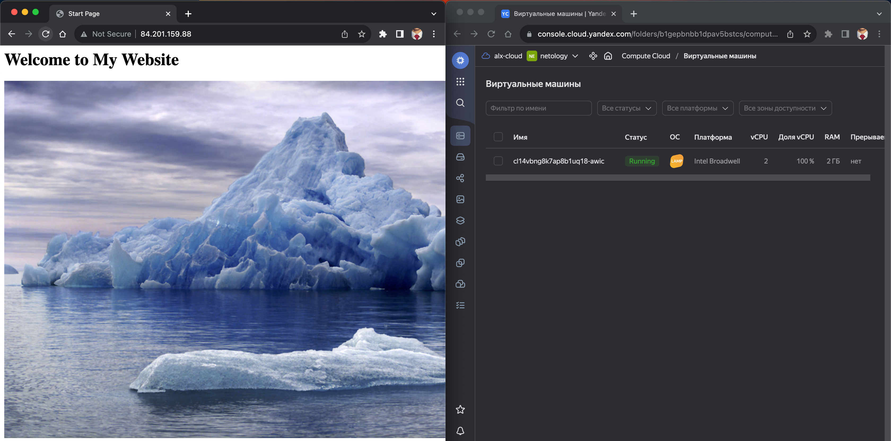
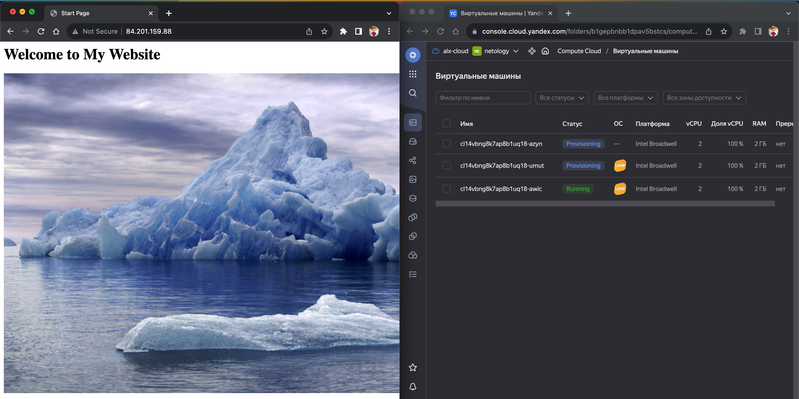
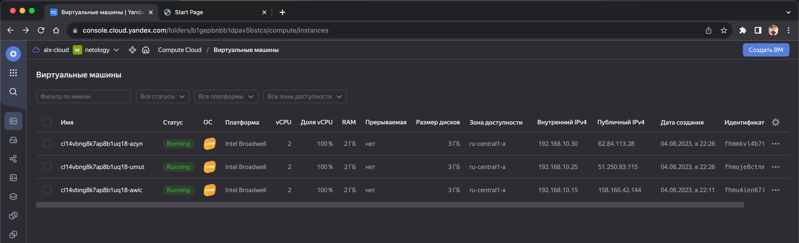

# Домашнее задание к занятию «Вычислительные мощности. Балансировщики нагрузки»

### Подготовка к выполнению задания

1. Домашнее задание состоит из обязательной части, которую нужно выполнить на провайдере Yandex Cloud, и дополнительной части в AWS (выполняется по желанию).
2. Все домашние задания в блоке 15 связаны друг с другом и в конце представляют пример законченной инфраструктуры.
3. Все задания нужно выполнить с помощью Terraform. Результатом выполненного домашнего задания будет код в репозитории.
4. Перед началом работы настройте доступ к облачным ресурсам из Terraform, используя материалы прошлых лекций и домашних заданий.

---

## Задание 1. Yandex Cloud

**Что нужно сделать**

1. Создать бакет Object Storage и разместить в нём файл с картинкой:

- Создать бакет в Object Storage с произвольным именем (например, _имя_студента_дата_).
- Положить в бакет файл с картинкой.
- Сделать файл доступным из интернета.

2. Создать группу ВМ в public подсети фиксированного размера с шаблоном LAMP и веб-страницей, содержащей ссылку на картинку из бакета:

- Создать Instance Group с тремя ВМ и шаблоном LAMP. Для LAMP рекомендуется использовать `image_id = fd827b91d99psvq5fjit`.
- Для создания стартовой веб-страницы рекомендуется использовать раздел `user_data` в [meta_data](https://cloud.yandex.ru/docs/compute/concepts/vm-metadata).
- Разместить в стартовой веб-странице шаблонной ВМ ссылку на картинку из бакета.
- Настроить проверку состояния ВМ.

3. Подключить группу к сетевому балансировщику:

- Создать сетевой балансировщик.
- Проверить работоспособность, удалив одну или несколько ВМ.

4. (дополнительно)* Создать Application Load Balancer с использованием Instance group и проверкой состояния.

Полезные документы:

- [Compute instance group](https://registry.terraform.io/providers/yandex-cloud/yandex/latest/docs/resources/compute_instance_group).
- [Network Load Balancer](https://registry.terraform.io/providers/yandex-cloud/yandex/latest/docs/resources/lb_network_load_balancer).
- [Группа ВМ с сетевым балансировщиком](https://cloud.yandex.ru/docs/compute/operations/instance-groups/create-with-balancer).

### Ответ

1. Создать бакет Object Storage и разместить в нём файл с картинкой:

- Создать бакет в Object Storage с произвольным именем (например, _имя_студента_дата_).

```terraform
resource "yandex_storage_bucket" "netology-bucket-wfghad" {
  access_key = var.access_key
  secret_key = var.secret_key
  bucket     = "netology-bucket-wfghad"
  max_size   = 1048576
}
```

- Положить в бакет файл с картинкой.

```terraform
resource "yandex_storage_object" "iceberg" {
  depends_on = [yandex_storage_bucket.netology-bucket-wfghad]
  access_key = var.access_key
  secret_key = var.secret_key
  bucket     = "netology-bucket-wfghad"
  key        = "Iceberg.jpg"
  source     = "content/Iceberg.jpg"
}
```

- Сделать файл доступным из интернета.

```terraform
resource "yandex_storage_object" "iceberg" {
  acl        = "public-read"
}
```

[Манифест object-storages.tf](terraform-yc/object-storages.tf)

2. Создать группу ВМ в public подсети фиксированного размера с шаблоном LAMP и веб-страницей, содержащей ссылку на картинку из бакета:

- Создать Instance Group с тремя ВМ и шаблоном LAMP. Для LAMP рекомендуется использовать `image_id = fd827b91d99psvq5fjit`.

```terraform
resource "yandex_vpc_network" "netology_network" {
  name = "netology-network"
}

resource "yandex_vpc_subnet" "public_subnet" {
  name           = "public-subnet"
  zone           = "ru-central1-a"
  network_id     = yandex_vpc_network.netology_network.id
  v4_cidr_blocks = ["192.168.10.0/24"]
}

resource "yandex_compute_instance_group" "lamp_instance_group" {
  name               = "lamp-instance-group"
  service_account_id = var.service_account_id
  folder_id          = var.folder_id

  instance_template {
    platform_id = "standard-v1"
    metadata = {
      ssh-keys  = "ubuntu:${file("~/.ssh/id_rsa.pub")}"
    }

    boot_disk {
      initialize_params {
        image_id = "fd827b91d99psvq5fjit"
      }
    }

    resources {
      cores  = 2
      memory = 2
    }

    network_interface {
      nat        = true
      network_id = yandex_vpc_network.netology_network.id
      subnet_ids = ["${yandex_vpc_subnet.public_subnet.id}"]
    }
  }

  scale_policy {
    fixed_scale {
      size = 3 # Количество ВМ в группе
    }
  }

  deploy_policy {
    max_unavailable = 2
    max_expansion   = 1
  }

  allocation_policy {
    zones = ["ru-central1-a"]
  }
}
```

- Для создания стартовой веб-страницы рекомендуется использовать раздел `user_data` в [meta_data](https://cloud.yandex.ru/docs/compute/concepts/vm-metadata).
- Разместить в стартовой веб-странице шаблонной ВМ ссылку на картинку из бакета.

```terraform
    metadata = {
      user-data = "#!/bin/bash\n echo \"<html><head><title>Start Page</title></head><body><h1>Welcome to My Website</h1></body></html>\" > /var/www/html/index.html"
    }
```

- Настроить проверку состояния ВМ.

Добавляем проверку состояния в yandex_compute_instance_group:

```terraform
  health_check {
    tcp_options {
      port = 80
    }
    interval            = 10 # Интервал проверки состояния ВМ в секундах
    timeout             = 5  # Время ожидания ответа от ВМ в секундах
    unhealthy_threshold = 3  # Количество неудачных попыток до пометки ВМ как нездоровой
  }
```

3. Подключить группу к сетевому балансировщику:

- Создать сетевой балансировщик.

```terraform
resource "yandex_lb_network_load_balancer" "netology-lb" {
  name = "netology-lb"

  attached_target_group {
    target_group_id = yandex_compute_instance_group.lamp_instance_group.load_balancer.0.target_group_id

    healthcheck {
      name                = "web"
      interval            = 10
      timeout             = 5
      unhealthy_threshold = 3
      tcp_options {
        port = 80
      }
    }
  }
  listener {
    name = "netology-lb-listener-http"
    port = 80
    external_address_spec {
      ip_version = "ipv4"
    }
  }

  listener {
    name = "netology-lb-listener-https"
    port = 443
    external_address_spec {
      ip_version = "ipv4"
    }
  }
}

output "yandex_lb_network_load_balancer" {
  value = yandex_lb_network_load_balancer.netology-lb.listener._.external_address_spec[0]._.address
}
```

Указываем балансировщик для instance-group:

```terraform
  load_balancer {
    target_group_name = "netology-lb"
  }
```

Финальные файлы манифеста:

- [Провайдер](terraform-yc/provider.tf)
- [network](terraform-yc/network.tf)
- [object-storage](terraform-yc/object-storages.tf)
- [instance-group](terraform-yc/instance-group.tf)

- Проверить работоспособность, удалив одну или несколько ВМ.

Запуск `terraform apply -auto-approve`:



Проверка работы страницы:



Удаление виртуальных машин для проверки работы сетевого балансировщика и health check для восстановления количества работающих VM:



Автоматическое восстановление количества виртуальных машин:





4. (дополнительно)* Создать Application Load Balancer с использованием Instance group и проверкой состояния.

---

## Задание 2*. AWS (задание со звёздочкой)

Это необязательное задание. Его выполнение не влияет на получение зачёта по домашней работе.

**Что нужно сделать**

Используя конфигурации, выполненные в домашнем задании из предыдущего занятия, добавить к Production like сети Autoscaling group из трёх EC2-инстансов с  автоматической установкой веб-сервера в private домен.

1. Создать бакет S3 и разместить в нём файл с картинкой:

- Создать бакет в S3 с произвольным именем (например, _имя_студента_дата_).
- Положить в бакет файл с картинкой.
- Сделать доступным из интернета.

2. Сделать Launch configurations с использованием bootstrap-скрипта с созданием веб-страницы, на которой будет ссылка на картинку в S3.
3. Загрузить три ЕС2-инстанса и настроить LB с помощью Autoscaling Group.

Resource Terraform:

- [S3 bucket](https://registry.terraform.io/providers/hashicorp/aws/latest/docs/resources/s3_bucket)
- [Launch Template](https://registry.terraform.io/providers/hashicorp/aws/latest/docs/resources/launch_template).
- [Autoscaling group](https://registry.terraform.io/providers/hashicorp/aws/latest/docs/resources/autoscaling_group).
- [Launch configuration](https://registry.terraform.io/providers/hashicorp/aws/latest/docs/resources/launch_configuration).

Пример bootstrap-скрипта:

```
#!/bin/bash
yum install httpd -y
service httpd start
chkconfig httpd on
cd /var/www/html
echo "<html><h1>My cool web-server</h1></html>" > index.html
```

### Правила приёма работы

Домашняя работа оформляется в своём Git репозитории в файле README.md. Выполненное домашнее задание пришлите ссылкой на .md-файл в вашем репозитории.
Файл README.md должен содержать скриншоты вывода необходимых команд, а также скриншоты результатов.
Репозиторий должен содержать тексты манифестов или ссылки на них в файле README.md.
