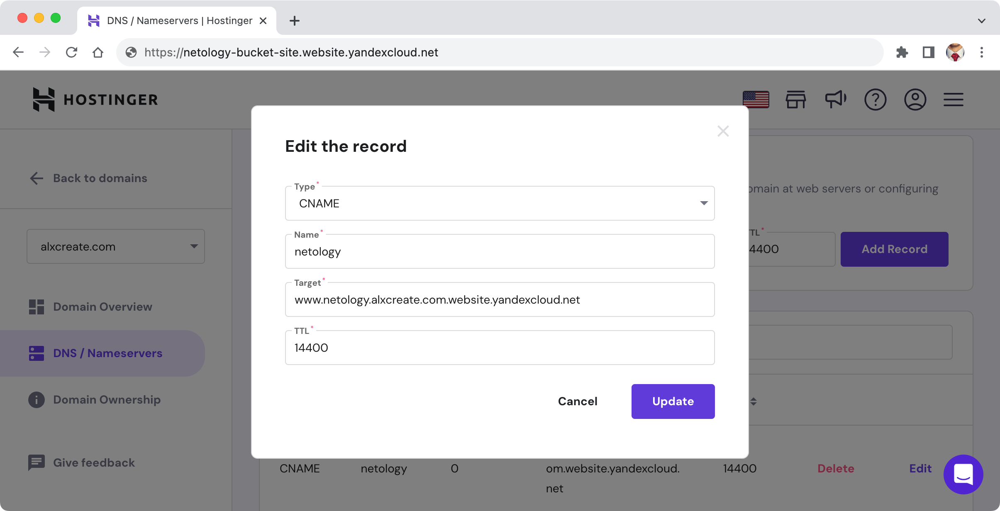
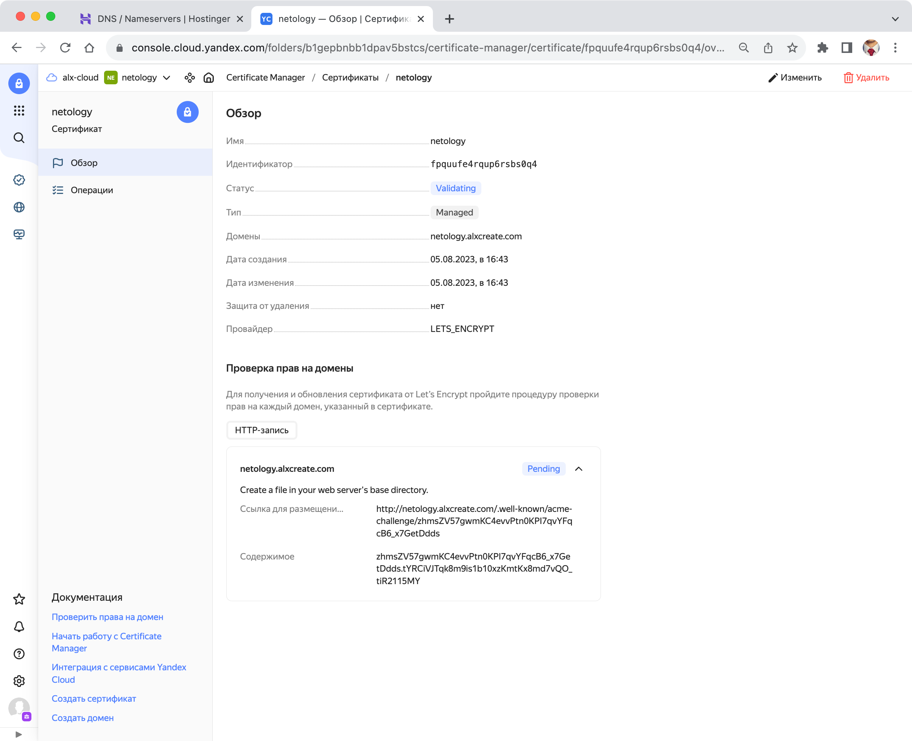
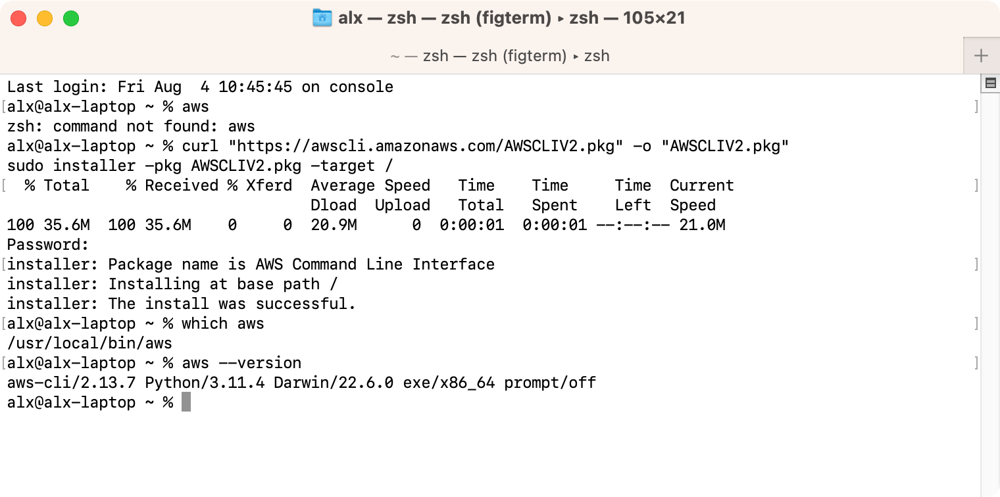
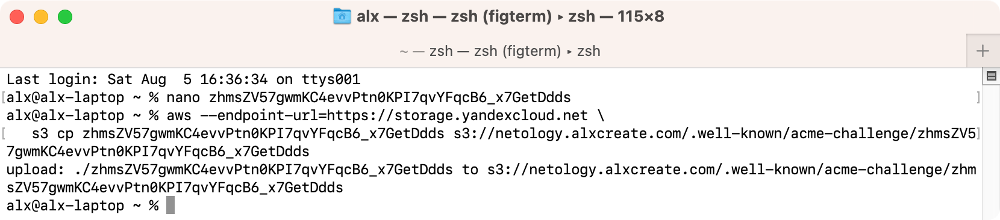
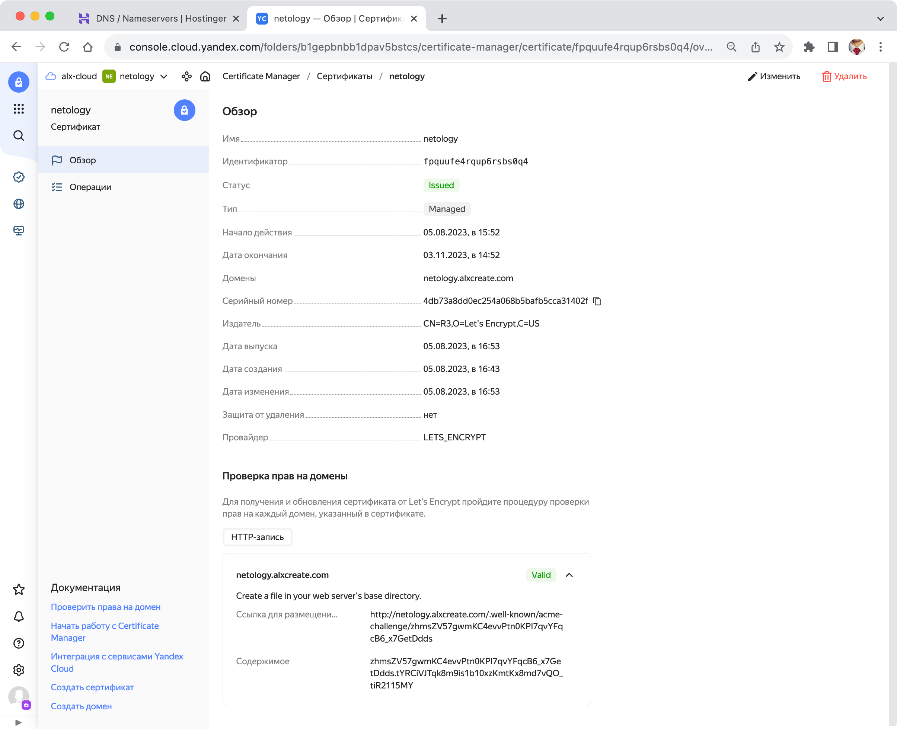
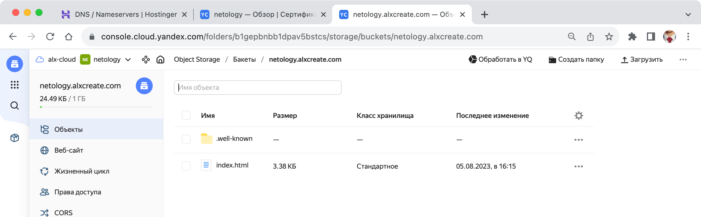
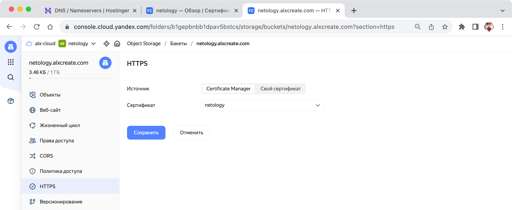

# Домашнее задание к занятию «Безопасность в облачных провайдерах»

Используя конфигурации, выполненные в рамках предыдущих домашних заданий, нужно добавить возможность шифрования бакета.

---

## Задание 1. Yandex Cloud

1. С помощью ключа в KMS необходимо зашифровать содержимое бакета:

- создать ключ в KMS;
- с помощью ключа зашифровать содержимое бакета, созданного ранее.

2. (Выполняется не в Terraform)* Создать статический сайт в Object Storage c собственным публичным адресом и сделать доступным по HTTPS:

- создать сертификат;
- создать статическую страницу в Object Storage и применить сертификат HTTPS;
- в качестве результата предоставить скриншот на страницу с сертификатом в заголовке (замочек).

Полезные документы:

- [Настройка HTTPS статичного сайта](https://cloud.yandex.ru/docs/storage/operations/hosting/certificate).
- [Object Storage bucket](https://registry.terraform.io/providers/yandex-cloud/yandex/latest/docs/resources/storage_bucket).
- [KMS key](https://registry.terraform.io/providers/yandex-cloud/yandex/latest/docs/resources/kms_symmetric_key).

## Ответ

1. С помощью ключа в KMS необходимо зашифровать содержимое бакета:

- создать ключ в KMS;

```terraform
resource "yandex_kms_symmetric_key" "object-storage-key" {
  name              = "object-storage-key"
  description       = "Key for object storage encryption"
  default_algorithm = "AES_128" # Алгоритм шифрования. Возможные значения: AES-128, AES-192 или AES-256.
  rotation_period   = "8760h"   # 1 год. Период ротации (частота смены версии ключа по умолчанию).
  lifecycle {
    prevent_destroy = true # Защита ключа от удаления (например, командой terraform destroy)
  }
}
```

- с помощью ключа зашифровать содержимое бакета, созданного ранее.

Для шифрования хранилища добавляем `server_side_encryption_configuration` в созданный в предыдущем уроке `resource "yandex_storage_bucket"`:

```terraform
resource "yandex_storage_bucket" "netology-bucket-wfghad" {
  access_key = var.access_key
  secret_key = var.secret_key
  bucket     = "netology-bucket-wfghad"
  max_size   = 1048576
  server_side_encryption_configuration {
    rule {
      apply_server_side_encryption_by_default {
        kms_master_key_id = yandex_kms_symmetric_key.object-storage-key.id # Идентификатор мастер ключа KMS, используемый для шифрования
        sse_algorithm     = "aws:kms"                                      # Используемый алгоритм шифрования на стороне сервера. Поддерживается только значение aws:kms
      }
    }
  }
}
```

Итоговый манифест:

- [provider](terraform-yc/provider.tf)
- [kms](terraform-yc/kms.tf)
- [object-storage](terraform-yc/object-storages.tf)

2. (Выполняется не в Terraform)* Создать статический сайт в Object Storage c собственным публичным адресом и сделать доступным по HTTPS:

Создаем CNAME для тестируемого доменного имени:



Создаем публичный бакет с именем `netology.alxcreate.com`.

- создать сертификат;

В сервисе Certificate Manager создаем сертификат:



Используя ссылку для размещения создаем файл `a8GyG-LkgmLo5vPtxSWn9TWyT0TuAeY-VGChHSQb-YY` и вставляем в него содержимое:

```
a8GyG-LkgmLo5vPtxSWn9TWyT0TuAeY-VGChHSQb-YY.zhIrnwrGMIRcxvYtP0U5yF7z47S9udw9kxSibB5bY9Y
```

Устанавливаем [awscli](https://docs.aws.amazon.com/cli/latest/userguide/getting-started-install.html) и [настраиваем](https://cloud.yandex.ru/docs/storage/tools/aws-cli) для работы:



Используя команду

```shell
aws --endpoint-url=https://storage.yandexcloud.net \
   s3 cp <имя файла> s3://<имя бакета>/.well-known/acme-challenge/<имя файла>
```

Загружаем файл в бакет в папку `.well-known/acme-challenge/`:

```shell
aws --endpoint-url=https://storage.yandexcloud.net \
   s3 cp a8GyG-LkgmLo5vPtxSWn9TWyT0TuAeY-VGChHSQb-YY s3://netology.alxcreate.com/.well-known/acme-challenge/a8GyG-LkgmLo5vPtxSWn9TWyT0TuAeY-VGChHSQb-YY
```



Дожидаемся обновления статуса сертификата:



Удаляем созданный файл:

```shell
aws --endpoint-url=https://storage.yandexcloud.net \
   s3 rm s3://netology.alxcreate.com/.well-known/acme-challenge/a8GyG-LkgmLo5vPtxSWn9TWyT0TuAeY-VGChHSQb-YY
```

- создать статическую страницу в Object Storage и применить сертификат HTTPS;

Создаем страницу и загружаем файл index.html и загружаем в бакет:



В настройках бакета настраиваем HTTPS - выбираем созданный сертификат:



- в качестве результата предоставить скриншот на страницу с сертификатом в заголовке (замочек).

Проверка работы HTTPS:


[https://netology.alxcreate.com](https://netology.alxcreate.com)

---

## Задание 2*. AWS (задание со звёздочкой)

Это необязательное задание. Его выполнение не влияет на получение зачёта по домашней работе.

**Что нужно сделать**

1. С помощью роли IAM записать файлы ЕС2 в S3-бакет:

- создать роль в IAM для возможности записи в S3 бакет;
- применить роль к ЕС2-инстансу;
- с помощью bootstrap-скрипта записать в бакет файл веб-страницы.

2. Организация шифрования содержимого S3-бакета:

- используя конфигурации, выполненные в домашнем задании из предыдущего занятия, добавить к созданному ранее бакету S3 возможность шифрования Server-Side, используя общий ключ;
- включить шифрование SSE-S3 бакету S3 для шифрования всех вновь добавляемых объектов в этот бакет.

3. *Создание сертификата SSL и применение его к ALB:

- создать сертификат с подтверждением по email;
- сделать запись в Route53 на собственный поддомен, указав адрес LB;
- применить к HTTPS-запросам на LB созданный ранее сертификат.

Resource Terraform:

- [IAM Role](https://registry.terraform.io/providers/hashicorp/aws/latest/docs/resources/iam_role).
- [AWS KMS](https://registry.terraform.io/providers/hashicorp/aws/latest/docs/resources/kms_key).
- [S3 encrypt with KMS key](https://registry.terraform.io/providers/hashicorp/aws/latest/docs/resources/s3_bucket_object#encrypting-with-kms-key).

Пример bootstrap-скрипта:

```
#!/bin/bash
yum install httpd -y
service httpd start
chkconfig httpd on
cd /var/www/html
echo "<html><h1>My cool web-server</h1></html>" > index.html
aws s3 mb s3://mysuperbacketname2021
aws s3 cp index.html s3://mysuperbacketname2021
```

### Правила приёма работы

Домашняя работа оформляется в своём Git репозитории в файле README.md. Выполненное домашнее задание пришлите ссылкой на .md-файл в вашем репозитории.
Файл README.md должен содержать скриншоты вывода необходимых команд, а также скриншоты результатов.
Репозиторий должен содержать тексты манифестов или ссылки на них в файле README.md.
