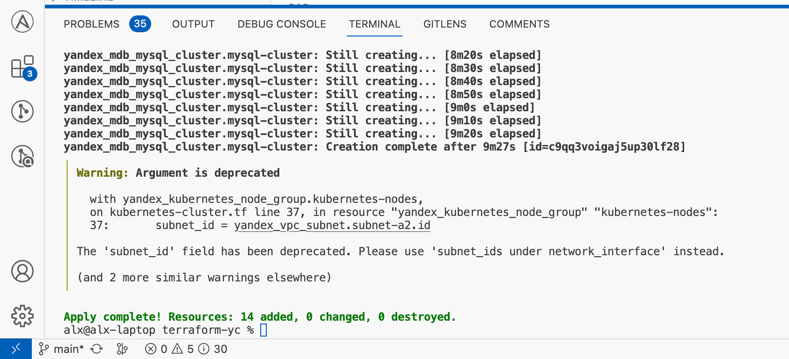
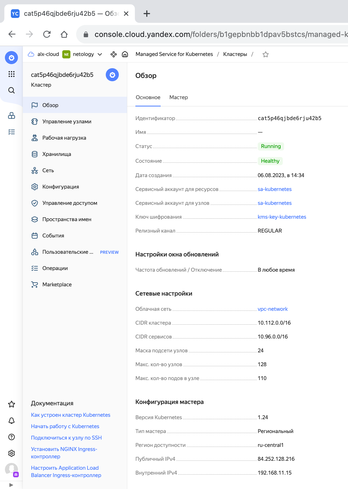
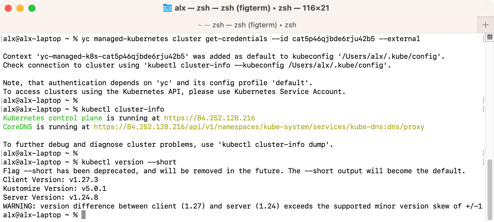

# Домашнее задание к занятию «Кластеры. Ресурсы под управлением облачных провайдеров»

### Цели задания

1. Организация кластера Kubernetes и кластера баз данных MySQL в отказоустойчивой архитектуре.
2. Размещение в private подсетях кластера БД, а в public — кластера Kubernetes.

---

## Задание 1. Yandex Cloud

1. Настроить с помощью Terraform кластер баз данных MySQL.

- Используя настройки VPC из предыдущих домашних заданий, добавить дополнительно подсеть private в разных зонах, чтобы обеспечить отказоустойчивость.
- Разместить ноды кластера MySQL в разных подсетях.
- Необходимо предусмотреть репликацию с произвольным временем технического обслуживания.
- Использовать окружение Prestable, платформу Intel Broadwell с производительностью 50% CPU и размером диска 20 Гб.
- Задать время начала резервного копирования — 23:59.
- Включить защиту кластера от непреднамеренного удаления.
- Создать БД с именем `netology_db`, логином и паролем.

2. Настроить с помощью Terraform кластер Kubernetes.

- Используя настройки VPC из предыдущих домашних заданий, добавить дополнительно две подсети public в разных зонах, чтобы обеспечить отказоустойчивость.
- Создать отдельный сервис-аккаунт с необходимыми правами.
- Создать региональный мастер Kubernetes с размещением нод в трёх разных подсетях.
- Добавить возможность шифрования ключом из KMS, созданным в предыдущем домашнем задании.
- Создать группу узлов, состояющую из трёх машин с автомасштабированием до шести.
- Подключиться к кластеру с помощью `kubectl`.
- *Запустить микросервис phpmyadmin и подключиться к ранее созданной БД.
- *Создать сервис-типы Load Balancer и подключиться к phpmyadmin. Предоставить скриншот с публичным адресом и подключением к БД.

Полезные документы:

- [MySQL cluster](https://registry.terraform.io/providers/yandex-cloud/yandex/latest/docs/resources/mdb_mysql_cluster).
- [Создание кластера Kubernetes](https://cloud.yandex.ru/docs/managed-kubernetes/operations/kubernetes-cluster/kubernetes-cluster-create)
- [K8S Cluster](https://registry.terraform.io/providers/yandex-cloud/yandex/latest/docs/resources/kubernetes_cluster).
- [K8S node group](https://registry.terraform.io/providers/yandex-cloud/yandex/latest/docs/resources/kubernetes_node_group).

## Ответ

1. Настроить с помощью Terraform кластер баз данных MySQL.

- Используя настройки VPC из предыдущих домашних заданий, добавить дополнительно подсеть private в разных зонах, чтобы обеспечить отказоустойчивость.

Созданы три подсети - по одной в каждой зоне:

```terraform
resource "yandex_vpc_network" "vpc-network" {
  name = "vpc-network"
}

resource "yandex_vpc_subnet" "subnet-a1" {
  name           = "subnet-a1"
  zone           = "ru-central1-a"
  network_id     = yandex_vpc_network.vpc-network.id
  v4_cidr_blocks = ["192.168.1.0/24"]
}

resource "yandex_vpc_subnet" "subnet-b1" {
  name           = "subnet-b1"
  zone           = "ru-central1-b"
  network_id     = yandex_vpc_network.vpc-network.id
  v4_cidr_blocks = ["192.168.2.0/24"]
}

resource "yandex_vpc_subnet" "subnet-c1" {
  name           = "subnet-c1"
  zone           = "ru-central1-c"
  network_id     = yandex_vpc_network.vpc-network.id
  v4_cidr_blocks = ["192.168.3.0/24"]
}

```

- Разместить ноды кластера MySQL в разных подсетях.

Создан манифест кластера базы данных MySQL с указанием каждой ноды в отдельной зоне и подсети:

```terraform
resource "yandex_mdb_mysql_cluster" "mysql-cluster" {
  name        = "mysql-cluster"
  network_id  = yandex_vpc_network.vpc-network.id
  version     = "8.0"

  host {
    zone      = "ru-central1-a"
    subnet_id = yandex_vpc_subnet.subnet-a1.id
  }

  host {
    zone      = "ru-central1-b"
    subnet_id = yandex_vpc_subnet.subnet-b1.id
  }

  host {
    zone      = "ru-central1-c"
    subnet_id = yandex_vpc_subnet.subnet-c1.id
  }
}
```

- Необходимо предусмотреть репликацию с произвольным временем технического обслуживания.

Для `yandex_mdb_mysql_cluster` добавлен блок:

```terraform
  maintenance_window {
    type = "ANYTIME"
  }
```

- Использовать окружение Prestable, платформу Intel Broadwell с производительностью 50% CPU и размером диска 20 Гб.

Для `yandex_mdb_mysql_cluster` добавлен параметр `environment = "PRESTABLE"` и блок:

```terraform
  resources {
    resource_preset_id = "b1.medium"
    disk_type_id       = "network-ssd"
    disk_size          = 20
  }
```

- Задать время начала резервного копирования — 23:59.

Для `yandex_mdb_mysql_cluster` добавлен блок:

```terraform
  backup_window_start {
    hours   = 23
    minutes = 59
  }
```

- Включить защиту кластера от непреднамеренного удаления.

Для защиты кластера от удаления добавлен параметр `deletion_protection = true`.

- Создать БД с именем `netology_db`, логином и паролем.

Для `yandex_mdb_mysql_cluster` добавлена база и пользователь:

```terraform
  database {
    name = "netology_db"
  }

  user {
    name     = "sa"
    password = "netology"
    permission {
      database_name = "netology_db"
      roles         = ["ALL"]
    }
  }
```

Результирующий манифест:

- [provider](terraform-yc/provider.tf)
- [mysql-cluster](terraform-yc/mysql-cluster.tf)
- [network](terraform-yc/network.tf)

2. Настроить с помощью Terraform кластер Kubernetes.

- Используя настройки VPC из предыдущих домашних заданий, добавить дополнительно две подсети public в разных зонах, чтобы обеспечить отказоустойчивость.

Созданы три подсети - по одной в каждой зоне:

```terraform
resource "yandex_vpc_subnet" "subnet-a2" {
  name           = "subnet-a2"
  zone           = "ru-central1-a"
  network_id     = yandex_vpc_network.vpc-network.id
  v4_cidr_blocks = ["192.168.11.0/24"]
}

resource "yandex_vpc_subnet" "subnet-b2" {
  name           = "subnet-b2"
  zone           = "ru-central1-b"
  network_id     = yandex_vpc_network.vpc-network.id
  v4_cidr_blocks = ["192.168.12.0/24"]
}

resource "yandex_vpc_subnet" "subnet-c2" {
  name           = "subnet-c2"
  zone           = "ru-central1-c"
  network_id     = yandex_vpc_network.vpc-network.id
  v4_cidr_blocks = ["192.168.12.0/24"]
}
```

- Создать отдельный сервис-аккаунт с необходимыми правами.

```terraform
resource "yandex_iam_service_account" "sa-kubernetes" {
  name        = "sa-kubernetes"
  description = "Service account for kubernetes cluster"
}

resource "yandex_resourcemanager_folder_iam_member" "editor" {
  # Сервисному аккаунту назначается роль "editor"
  folder_id = var.folder_id
  role      = "editor"
  member    = "serviceAccount:${yandex_iam_service_account.sa-kubernetes.id}"
}

resource "yandex_resourcemanager_folder_iam_member" "images-puller" {
  # Сервисному аккаунту назначается роль "container-registry.images.puller"
  folder_id = var.folder_id
  role      = "container-registry.images.puller"
  member    = "serviceAccount:${yandex_iam_service_account.sa-kubernetes.id}"
}
```

- Создать региональный мастер Kubernetes с размещением нод в трёх разных подсетях.

```terraform
resource "yandex_kubernetes_cluster" "kubernetes-cluster" {
  network_id = yandex_vpc_network.vpc-network.id
  master {
    regional {
      region = "ru-central1"
      location {
        zone      = yandex_vpc_subnet.subnet-a2.zone
        subnet_id = yandex_vpc_subnet.subnet-a2.id
      }
      location {
        zone      = yandex_vpc_subnet.subnet-b2.zone
        subnet_id = yandex_vpc_subnet.subnet-b2.id
      }
      location {
        zone      = yandex_vpc_subnet.subnet-c2.zone
        subnet_id = yandex_vpc_subnet.subnet-c2.id
      }
    }
    public_ip = true
  }
  service_account_id      = yandex_iam_service_account.sa-kubernetes.id
  node_service_account_id = yandex_iam_service_account.sa-kubernetes.id
  kms_provider {
    key_id = yandex_kms_symmetric_key.kms-key-kubernetes.id
  }
  depends_on = [
    yandex_resourcemanager_folder_iam_member.editor,
    yandex_resourcemanager_folder_iam_member.images-puller
  ]
}
```

- Добавить возможность шифрования ключом из KMS, созданным в предыдущем домашнем задании.

Создание ключа:

```terraform
resource "yandex_kms_symmetric_key" "kms-key-kubernetes" {
  # Ключ для шифрования
  name              = "kms-key-kubernetes"
  default_algorithm = "AES_128"
  rotation_period   = "8760h" # 1 год
}
```

Указание ключа для `yandex_kubernetes_cluster`:

```terraform
  kms_provider {
    key_id = yandex_kms_symmetric_key.kms-key-kubernetes.id
  }
```

- Создать группу узлов, состояющую из трёх машин с автомасштабированием до шести.

Манифест группы узлов с автомасштабированием:

```terraform
resource "yandex_kubernetes_node_group" "kubernetes-nodes" {
  cluster_id = yandex_kubernetes_cluster.kubernetes-cluster.id
  name       = "kubernetes-nodes"
  allocation_policy {
    location {
      zone      = yandex_vpc_subnet.subnet-a2.zone
      subnet_id = yandex_vpc_subnet.subnet-a2.id
    }
  }
  instance_template {
    platform_id = "standard-v1"
    resources {
      cores = 2
    }
    container_runtime {
      type = "containerd"
    }
  }
  scale_policy {
    auto_scale {
      min     = 3
      max     = 6
      initial = 3
    }
  }
}
```

Финальный манифест:

- [provider](terraform-yc/provider.tf)
- [network](terraform-yc/network.tf)
- [kubernetes-cluster](terraform-yc/kubernetes-cluster.tf)

- Подключиться к кластеру с помощью `kubectl`.

Применяем конфигурацию через `terraform apply -auto-approve`:



Получаем настроенный кластер kubernetes в Яндекс Облаке:



Получаем конфигурацию кластера и проверяем подключение:



- *Запустить микросервис phpmyadmin и подключиться к ранее созданной БД.
- *Создать сервис-типы Load Balancer и подключиться к phpmyadmin. Предоставить скриншот с публичным адресом и подключением к БД.

---

## Задание 2*. Вариант с AWS (задание со звёздочкой)

Это необязательное задание. Его выполнение не влияет на получение зачёта по домашней работе.

**Что нужно сделать**

1. Настроить с помощью Terraform кластер EKS в три AZ региона, а также RDS на базе MySQL с поддержкой MultiAZ для репликации и создать два readreplica для работы.

- Создать кластер RDS на базе MySQL.
- Разместить в Private subnet и обеспечить доступ из public сети c помощью security group.
- Настроить backup в семь дней и MultiAZ для обеспечения отказоустойчивости.
- Настроить Read prelica в количестве двух штук на два AZ.

2. Создать кластер EKS на базе EC2.

- С помощью Terraform установить кластер EKS на трёх EC2-инстансах в VPC в public сети.
- Обеспечить доступ до БД RDS в private сети.
- С помощью kubectl установить и запустить контейнер с phpmyadmin (образ взять из docker hub) и проверить подключение к БД RDS.
- Подключить ELB (на выбор) к приложению, предоставить скрин.

Полезные документы:

- [Модуль EKS](https://learn.hashicorp.com/tutorials/terraform/eks).

### Правила приёма работы

Домашняя работа оформляется в своём Git репозитории в файле README.md. Выполненное домашнее задание пришлите ссылкой на .md-файл в вашем репозитории.
Файл README.md должен содержать скриншоты вывода необходимых команд, а также скриншоты результатов.
Репозиторий должен содержать тексты манифестов или ссылки на них в файле README.md.
