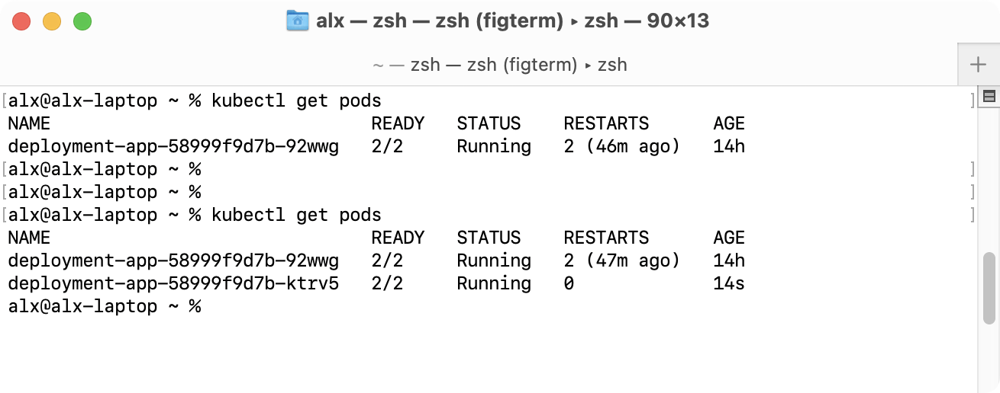
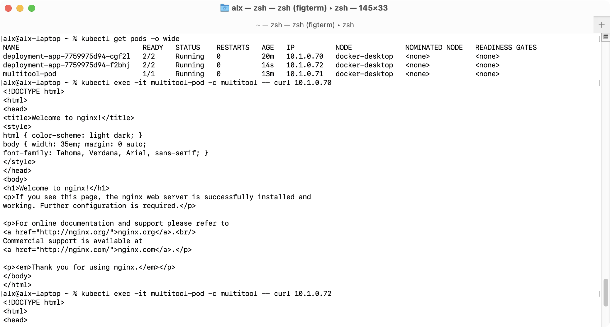
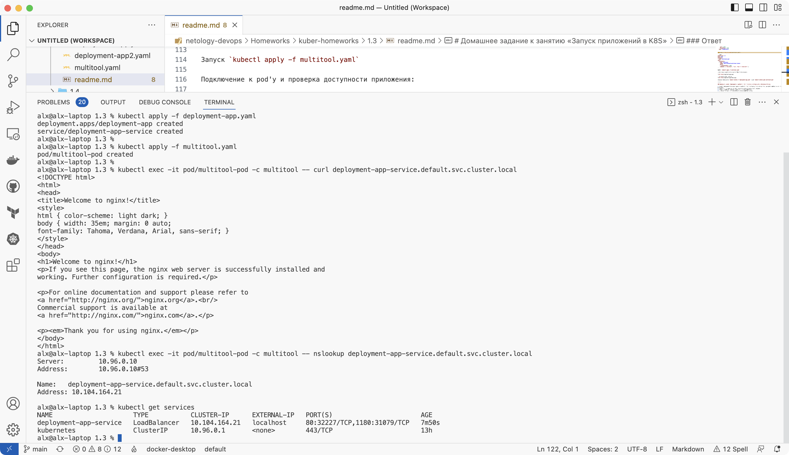
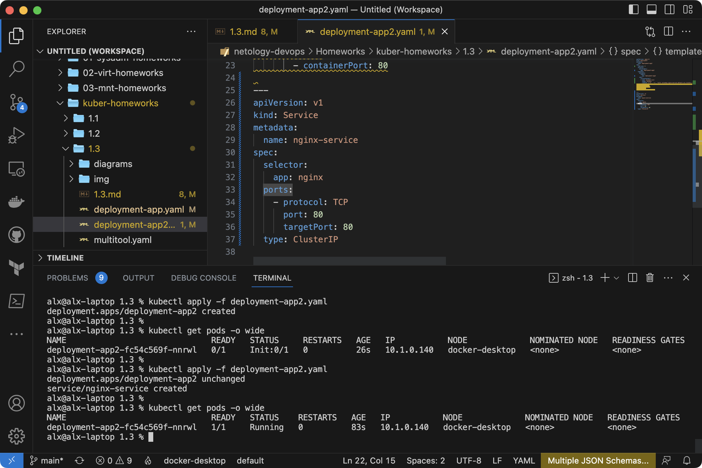

# Домашнее задание к занятию «Запуск приложений в K8S»

### Цель задания

В тестовой среде для работы с Kubernetes, установленной в предыдущем ДЗ, необходимо развернуть Deployment с приложением, состоящим из нескольких контейнеров, и масштабировать его.

------

### Чеклист готовности к домашнему заданию

1. Установленное k8s-решение (например, MicroK8S).
2. Установленный локальный kubectl.
3. Редактор YAML-файлов с подключённым git-репозиторием.

------

### Инструменты и дополнительные материалы, которые пригодятся для выполнения задания

1. [Описание](https://kubernetes.io/docs/concepts/workloads/controllers/deployment/) Deployment и примеры манифестов.
2. [Описание](https://kubernetes.io/docs/concepts/workloads/pods/init-containers/) Init-контейнеров.
3. [Описание](https://github.com/wbitt/Network-MultiTool) Multitool.

------

### Задание 1. Создать Deployment и обеспечить доступ к репликам приложения из другого Pod

1. Создать Deployment приложения, состоящего из двух контейнеров — nginx и multitool. Решить возникшую ошибку.
2. После запуска увеличить количество реплик работающего приложения до 2.
3. Продемонстрировать количество подов до и после масштабирования.
4. Создать Service, который обеспечит доступ до реплик приложений из п.1.
5. Создать отдельный Pod с приложением multitool и убедиться с помощью `curl`, что из пода есть доступ до приложений из п.1.

### Ответ

1. Создан [манифест](deployment-app.yaml) деплоймента. Проблема была в завершении контейнера multitool. Добавлена команда которая не позволяет ему остановиться.

```yaml
apiVersion: apps/v1
kind: Deployment
metadata:
  name: deployment-app
spec:
  replicas: 1
  selector:
    matchLabels:
      app: deployment-app
  template:
    metadata:
      labels:
        app: deployment-app
    spec:
      containers:
      - name: nginx
        image: nginx
        ports:
        - containerPort: 80
      - name: multitool
        image: wbitt/network-multitool:latest
        ports:
        - containerPort: 1180
        command: [ "/bin/bash", "-ce", "tail -f /dev/null" ]
```

Запуск `kubectl apply -f deployment-app.yaml`

2. Для изменения количества реплик изменен параметр `replicas` на 2.

```yaml
spec:
  replicas: 2
```

3. До и после изменения количества реплик:



4. Создание сервиса для доступа к репликам:

```yaml
---
apiVersion: v1
kind: Service
metadata:
  name: deployment-app-service
spec:
  selector:
    app: deployment-app
  ports:
  - name: nginx-port
    port: 80
    targetPort: 80
  - name: multitool-port
    port: 1180
    targetPort: 1180
  type: LoadBalancer
  ```

5. Создан [отдельный pod](multitool.yaml):

```yaml
apiVersion: v1
kind: Pod
metadata:
  name: multitool-pod
spec:
  containers:
  - name: multitool
    image: wbitt/network-multitool:latest
    ports:
    - containerPort: 1180
    command: [ "/bin/bash", "-ce", "tail -f /dev/null" ]
```

Запуск `kubectl apply -f multitool.yaml`

Подключение к pod'у и проверка доступности приложения:



Проверка по имени ресурса:


Удаление деплоймента `kubectl delete -f deployment-app.yaml` и pod `kubectl delete pods multitool-pod`

------

### Задание 2. Создать Deployment и обеспечить старт основного контейнера при выполнении условий

1. Создать Deployment приложения nginx и обеспечить старт контейнера только после того, как будет запущен сервис этого приложения.
2. Убедиться, что nginx не стартует. В качестве Init-контейнера взять busybox.
3. Создать и запустить Service. Убедиться, что Init запустился.
4. Продемонстрировать состояние пода до и после запуска сервиса.

### Ответ

1. Создан [манифест](deployment-app2.yaml) nginx:

```yaml
apiVersion: apps/v1
kind: Deployment
metadata:
  name: deployment-app2
spec:
  replicas: 1
  selector:
    matchLabels:
      app: deployment-app2
  template:
    metadata:
      labels:
        app: deployment-app2
    spec:
      containers:
      - name: nginx
        image: nginx
        ports:
        - containerPort: 80
```

2. В конфигурацию добавлен init-контейнер:

```yaml
      initContainers:
      - name: busybox-init
        image: busybox
        command: ['sh', '-c', "until nslookup nginx-service.default.svc.cluster.local >/dev/null 2>&1; do echo waiting for service; sleep 1; done;"]
```

Запуск `kubectl apply -f deployment-app2.yaml`

Контейнер не запускается.

3. В конфигурацию добавлен Service:

```yaml
---
apiVersion: v1
kind: Service
metadata:
  name: nginx-service
spec:
  selector:
    app: nginx
  ports:
    - protocol: TCP
      port: 80
      targetPort: 80
  type: ClusterIP
```

Запуск `kubectl apply -f deployment-app2.yaml`

Контейнер init выполнился т.к. прошла проверка доступности сервиса. Запустился основной контейнер сервиса.

Состояние пода до и после запуска сервиса:



------

### Правила приема работы

1. Домашняя работа оформляется в своем Git-репозитории в файле README.md. Выполненное домашнее задание пришлите ссылкой на .md-файл в вашем репозитории.
2. Файл README.md должен содержать скриншоты вывода необходимых команд `kubectl` и скриншоты результатов.
3. Репозиторий должен содержать файлы манифестов и ссылки на них в файле README.md.

------
